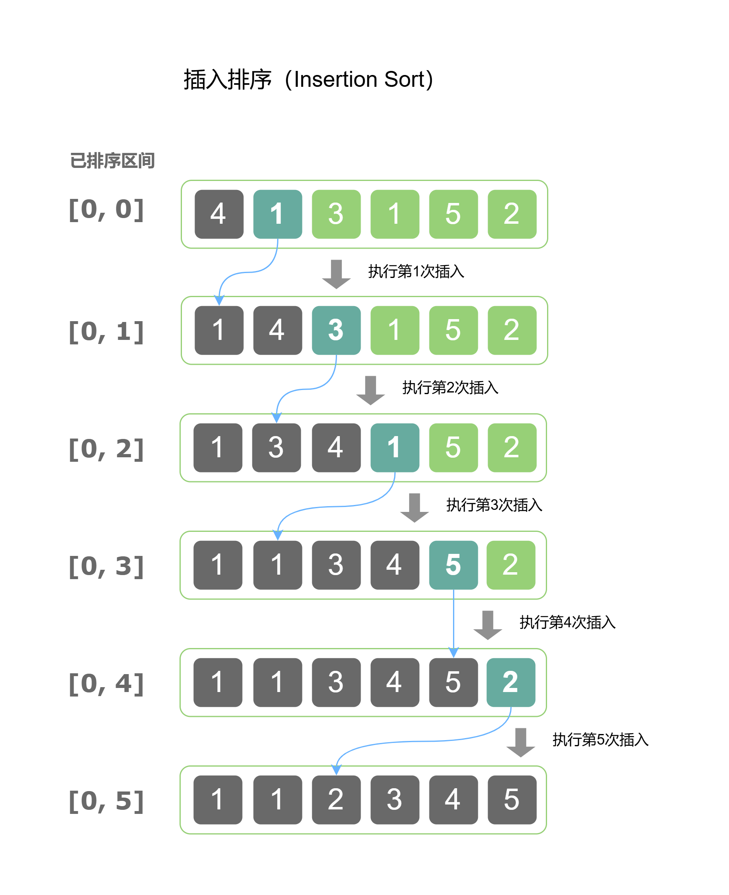

# 插入排序 (Insertion Sort)

# 1. 原理
- 插入排序通过构建**已排序部分**和**未排序部分**，每次 **从未排序部分取出一个元素并插入到已排序部分的合适位置** ，直到整个数组有序。
- 简单理解：从未排序部分中顺序取出一个元素，跟已排序的部分比较，放在对应的位置。
- 时间复杂度为 $O(n^2)$，空间复杂度为 $O(1)$。

# 2. 排序步骤说明

- 设定第一个元素已排序，从第二个元素开始。
- 将**该元素与已排序部分的元素逐个比较，直到找到正确位置并插入**。
- 重复以上步骤，直到所有元素有序。

# 3. 插入排序示例图



# 4. 插入排序代码实现

## 4.1 C++

```c++
#include <iostream>
using namespace std;

void insertionSort(int arr[], int n) {
    for (int i = 1; i < n; i++) {
        int key = arr[i];
        int j = i - 1;
        
        // 移动大于 key 的元素到右边
        while (j >= 0 && arr[j] > key) {
            arr[j + 1] = arr[j];
            j--;
        }
        
        arr[j + 1] = key;
    }
}

int main() {
    int arr[] = {12, 11, 13, 5, 6};
    int n = sizeof(arr) / sizeof(arr[0]);
    
    insertionSort(arr, n);
    
    cout << "Sorted array: ";
    for (int i = 0; i < n; i++) {
        cout << arr[i] << " ";
    }
    return 0;
}

```

## 4.2 Java

```java
public class InsertionSort {
    public static void insertionSort(int[] arr) {
        for (int i = 1; i < arr.length; i++) {
            int key = arr[i];
            int j = i - 1;
            
            // 移动大于 key 的元素到右边
            while (j >= 0 && arr[j] > key) {
                arr[j + 1] = arr[j];
                j--;
            }
            
            arr[j + 1] = key;
        }
    }
    
    public static void main(String[] args) {
        int[] arr = {5, 2, 9, 1, 5, 6};
        
        insertionSort(arr);
        
        System.out.print("Sorted array: ");
        for (int i = 0; i < arr.length; i++) {
            System.out.print(arr[i] + " ");
        }
    }
}
```

## 4.3 JavaScript

```javascript
function insertionSort(arr) {
    for (let i = 1; i < arr.length; i++) {
        let key = arr[i];
        let j = i - 1;
        
        // 移动大于 key 的元素到右边
        while (j >= 0 && arr[j] > key) {
            arr[j + 1] = arr[j];
            j--;
        }
        
        arr[j + 1] = key;
    }
}

// 测试
let arr = [5, 2, 9, 1, 5, 6];
insertionSort(arr);
console.log("Sorted array:", arr);
```

# 5. 插入排序示例详解

- 输入：`[29, 18, 14, 37, 13]`，使用插入排序对其进行排序。

## 5.1 第一次外层循环：`i = 1`

- 当前 `key = arr[1] = 18`
- 内层循环的目标是将 `key` 插入到已排序的部分 `[29]`。

### 5.1.1 内层循环步骤：

- `j = i - 1 = 0`，即比较 `arr[0]` 和 `key`：
- `arr[j] = 29`，`key = 18`
- 由于 `arr[j] > key`，即 `29 > 18`，我们将 `arr[j]` 向右移动：
- `arr[j + 1] = arr[j]`，所以 `arr[1] = 29`，数组变为 `[29, 29, 14, 37, 13]`
- 然后 `j--`，`j = -1`，退出内层循环。

### 5.1.2 插入 `key`：

- `j = -1`，表示 `key` 应插入到数组的第一个位置，即 `arr[0]`。
- 所以，我们将 `arr[0] = 18`，数组变为 `[18, 29, 14, 37, 13]`。

### 5.1.3 第一次外层循环结束后，数组为： `[18, 29, 14, 37, 13]`

## 5.2 第二次外层循环：`i = 2`

- 当前 `key = arr[2] = 14`
- 内层循环的目标是将 `key` 插入到已排序的部分 `[18, 29]`。

### 5.2.1 内层循环步骤：

- `j = i - 1 = 1`，即比较 `arr[1]` 和 `key`：
- `arr[j] = 29`，`key = 14`
- 由于 `arr[j] > key`，即 `29 > 14`，我们将 `arr[j]` 向右移动：
- `arr[j + 1] = arr[j]`，所以 `arr[2] = 29`，数组变为 `[18, 29, 29, 37, 13]`
- 然后 `j--`，`j = 0`，继续比较 `arr[j]` 和 `key`：
- `arr[j] = 18`，`key = 14`
- 由于 `arr[j] > key`，即 `18 > 14`，我们将 `arr[j]` 向右移动：
- `arr[j + 1] = arr[j]`，所以 `arr[1]` = 18，数组变为 `[18, 18, 29, 37, 13]`
- 然后 `j--`，`j = -1`，退出内层循环。

### 5.2.2 插入 key：

- `j = -1`，表示 `key` 应插入到数组的第一个位置，即 `arr[0]`。
- 所以，我们将 `arr[0] = 14`，数组变为 `[14, 18, 29, 37, 13]`。

### 5.2.3 第二次外层循环结束后，数组为： `[14, 18, 29, 37, 13]`

## 5.3 第三次外层循环：`i = 3`

- 当前 `key = arr[3] = 37`
- 内层循环的目标是将 `key` 插入到已排序的部分 `[14, 18, 29]`。

### 5.3.1 内层循环步骤：

- `j = i - 1 = 2`，即比较 `arr[2]` 和 `key`：
- `arr[j] = 29`，`key = 37`
- 由于 `arr[j] < key`，即 `29 < 37`，不需要移动，内层循环退出。

### 5.3.2 插入 key：

- 因为没有元素大于 `key`，所以 `key` 已经在正确的位置，数组保持不变：`[14, 18, 29, 37, 13]`。

### 5.3.3 第三次外层循环结束后，数组为： `[14, 18, 29, 37, 13]`

## 5.4 第四次外层循环：`i = 4`

- 当前 `key = arr[4] = 13`
- 内层循环的目标是将 `key` 插入到已排序的部分 `[14, 18, 29, 37]`。

### 5.4.1 内层循环步骤：

- `j = i - 1 = 3`，即比较 `arr[3]` 和 `key`：
  - `arr[j] = 37`，`key = 13`
  - 由于 `arr[j] > key`，即 `37 > 13`，我们将 `arr[j]` 向右移动：
    - `arr[j + 1] = arr[j]`，所以 `arr[4] = 37`，数组变为 `[14, 18, 29, 37, 37]`
  - 然后 `j--`，`j = 2`，继续比较 `arr[j]` 和 `key`：
    - `arr[j] = 29`，`key = 13`
    - 由于 `arr[j] > key`，即 `29 > 13`，我们将 `arr[j]` 向右移动：
      - `arr[j + 1] = arr[j]`，所以 `arr[3] = 29`，数组变为 `[14, 18, 29, 29, 37]`
  - 然后 `j--`，`j = 1`，继续比较 `arr[j]` 和 `key`：
    - `arr[j] = 18`，`key = 13`
    - 由于 `arr[j] > key`，即 `18 > 13`，我们将 `arr[j]` 向右移动：
      - `arr[j + 1] = arr[j]`，所以 `arr[2] = 18`，数组变为 `[14, 18, 18, 29, 37]`
  - 然后 `j--`，`j = 0`，继续比较 `arr[j]` 和 `key`： 
    - `arr[j] = 14`，`key = 13`
    - 由于 `arr[j] > key`，即 `14 > 13`，我们将 `arr[j]` 向右移动： 
      - `arr[j + 1] = arr[j]`，所以 `arr[1] = 14`，数组变为 `[14, 14, 18, 29, 37]`
  - 然后 `j--`，`j = -1`，退出内层循环。

### 5.4.2 插入 key：

- `j = -1`，表示 `key` 应插入到数组的第一个位置，即 `arr[0]`。
- 所以，我们将 `arr[0] = 13`，数组变为 `[13, 14, 18, 29, 37]`。

### 5.4.3 第四次外层循环结束后，数组为： `[13, 14, 18, 29, 37]`

## 5.5 最终排序结果：`[13, 14, 18, 29, 37]`

# 6. 插入排序代码示例

- 对 `[64, 34, 25, 12, 22, 11, 90]` 进行排序。

```text
i = 1    j = 0    key = 34       arr: [64,34,25,12,22,11,90]
i = 1    j = 0    key = 34       arr: [64,64,25,12,22,11,90]
i = 2    j = 1    key = 25       arr: [34,64,25,12,22,11,90]
i = 2    j = 1    key = 25       arr: [34,64,64,12,22,11,90]
i = 2    j = 0    key = 25       arr: [34,34,64,12,22,11,90]
i = 3    j = 2    key = 12       arr: [25,34,64,12,22,11,90]
i = 3    j = 2    key = 12       arr: [25,34,64,64,22,11,90]
i = 3    j = 1    key = 12       arr: [25,34,34,64,22,11,90]
i = 3    j = 0    key = 12       arr: [25,25,34,64,22,11,90]
i = 4    j = 3    key = 22       arr: [12,25,34,64,22,11,90]
i = 4    j = 3    key = 22       arr: [12,25,34,64,64,11,90]
i = 4    j = 2    key = 22       arr: [12,25,34,34,64,11,90]
i = 4    j = 1    key = 22       arr: [12,25,25,34,64,11,90]
i = 5    j = 4    key = 11       arr: [12,22,25,34,64,11,90]
i = 5    j = 4    key = 11       arr: [12,22,25,34,64,64,90]
i = 5    j = 3    key = 11       arr: [12,22,25,34,34,64,90]
i = 5    j = 2    key = 11       arr: [12,22,25,25,34,64,90]
i = 5    j = 1    key = 11       arr: [12,22,22,25,34,64,90]
i = 5    j = 0    key = 11       arr: [12,12,22,25,34,64,90]
i = 6    j = 5    key = 90       arr: [11,12,22,25,34,64,90]
```


