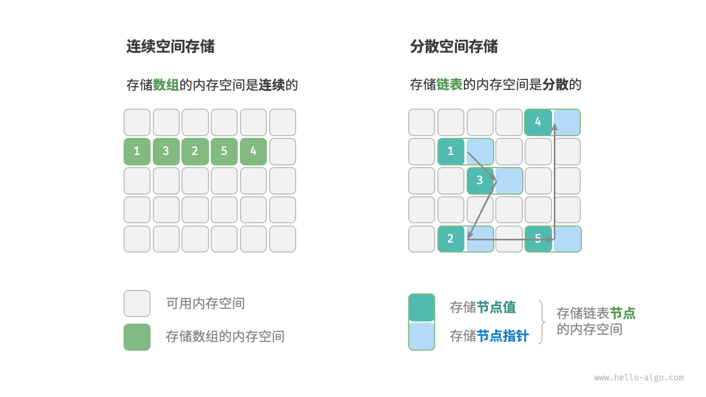

# 数据结构

# 1. 数据结构分类

- 常见的数据结构：**数组、链表、栈、队列、哈希表、树、堆、图**。
- 线性结构：每个元素最多只有一个出度和入度，表示为一条线状。线性表按**存储方式**分为**顺序表**和**链表**。
- 顺序存储：用一组地址连续的存储单元，依次存储线性表中的数据元素，使得逻辑上相邻的元素存储上也相邻。
  - 查询速度快，插入和删除速度慢。读运算是O(1)，依据索引直接读取；查找、修改、删除运算是O(n)。
- 链式存储：存储个数据元素上的结点的地址不要求连续，数据元素逻辑上相邻，物理上分开。
  - 查询速度慢，插入和删除速度快。
- 线性数据结构：数组、链表、栈、队列。
- 非线性数据结构：树、堆、图、哈希表。

## 1.2 物理结构：连续与分散

- **当算法程序运行时，正在处理的数据主要存储在内存中。系统通过内存地址来访问目标位置的数据。**
- 物理结构反应了数据在计算机内存中的存储方式。
- 所有的数据结构都是基于**数组、链表或二者的结合实现**的。
  - **基于数组实现**：栈、队列、哈希表、树、堆、图、矩阵、张量（维度>=3的数组）等。
  - **基于链表实现**：栈、队列、哈希表、树、堆、图等。

