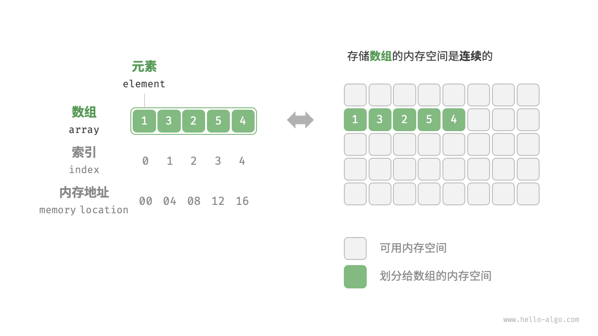

# 数组

# 1. 什么是数组？

## 1.1 数组的定义

数组是一种非常常见的**线性数据结构**，具有**一定的长度，连续内存，存储相同类型的元素，每个元素都有对应的索引**，可以通过索引对元素进行访问操作。



以下内容来自维基百科 [数组](https://zh.wikipedia.org/wiki/%E6%95%B0%E7%BB%84)

> 在计算机科学中，数组数据结构（英语：array data structure），简称数组（英语：Array），是由相同类型的元素（element）的集合所组成的数据结构，分配一块连续的内存来存储。利用元素的索引（index）可以计算出该元素对应的存储地址。
  
>  最简单的数据结构类型是一维数组。例如，索引为0到9的32位整数数组，可作为在存储器地址2000，2004，2008，...2036中，存储 10 个变量，因此索引为i的元素即在存储器中的 2000+4×i 地址。数组第一个元素的存储器地址称为第一地址或基础地址。

## 1.2 一个数组的示例

假如现在我们有数组 nums，数组的起始内存地址为 `0x62fee4`，数组的长度为 10，里边每一个元素的大小都为 32 位的 int 型，在 32 位下每个 int 型数值都占 4 个字节。那么我们可以知道，数组 nums 的长度为 10 * 4 = 40 个字节。所以我们对 nums 的起始内存地址向后移动 40 个字节，就得到了数组 nums 结束内存地址，也就是 `0x62ff08`，计算方法就是 `0x62fee4` 加上 40，得到 `0x62ff08`，就是 nums 结束的内存地址。

定义数组的时候，不需要把 10 个元素全部填充满，可以填充其中的 n (0 <= n <= 10)个，但是，不管是 n 是等于 0 或 1 或 2 或 10，都不会改变数组结束的内存位置，因为数组的起始结束位置在定义的时候就已经固定了。所以数组元素是否填充满，不影响数组的结束位置。

```c++
// 输入
int main() {
  int nums[10] = {1, 2, 3, 4, 5, 6, 7, 8, 9, 10};

  for (int i = 0; i < 10; i++) {
    cout << "nums[" << i << "] = " << nums[i] << ", memory address = "<< &nums[i] << endl;
  }
  return 0;
}
```

```text
// 输出
nums[0] = 1, memory address = 0x62fee4
nums[1] = 2, memory address = 0x62fee8
nums[2] = 3, memory address = 0x62feec
nums[3] = 4, memory address = 0x62fef0
nums[4] = 5, memory address = 0x62fef4
nums[5] = 6, memory address = 0x62fef8
nums[6] = 7, memory address = 0x62fefc
nums[7] = 8, memory address = 0x62ff00
nums[8] = 9, memory address = 0x62ff04
nums[9] = 10, memory address = 0x62ff08
```

## 1.3 数组的优缺点

- 优点：空间效率高，支持随机访问，缓存局部性。
- 缺点：插入与删除效率低，长度不可变，空间昂费。

## 1.4 数据典型应用

- 随机访问
- 排序和搜索
- 查找表
- 机器学习
- 数据结构实现

# 2. 思考两个问题
## 2.1 为什么数组要固定长度？可以不固定长度吗？

答案，可以固定长度，但是，也可以不固定长度。

数组是存储在内存中的，每次我们使用内存空间，都要去内存空间中申请。

**以固定长度** 是因为固定长度可以节约内存空间，可以实现常数时间的随机访问，边界安全，因为数组的长度固定，所以边界固定。

**不固定长度** 也就是**动态数组**，意味着编译器在存储该数组的时候，就要时刻知道当前数组已经使用的容量是多少，还有多少容量可以使用，如果剩余可用容量比较小，那么就要实现内存的动态分配和数据迁移，这将会带来额外的性能损耗。

## 2.2 为什么数组中的元素类型要相同？

因为这就是数组这种数据结构的定义，就是这么规定的。

但是凡事都有例外，就像 JavaScript 里的数组里的元素就可以不一样。

```javascript
var arr = [1, 2, true, false, null, 'hello', { name: 'jack' }];
```

虽然说 JavaScript 里的 Array 是数组，但是由于 JavaScript 这门语言自身的特点，Array 本质上是一个 Object 的一个实例。

同样类比 Python 语言，在 Python 里，list 也可以存储不同的数据类型。

```python
arr = [1, 2, 3, True, False, None, 'hello', {'name': 'jack'}];
```

# 3. 操作数组中的元素：访问、修改、添加、删除

数组中的元素可以通过下标进行随机访问，而且访问的时间就是 O(1)，不需要耗费其他的时间或空间去查找元素，所以能够快速的访问到目标元素。

示例数组：` int nums[10] = {1, 2, 3, 4, 5};`

## 3.1 修改数组中元素

直接通过索引，修改索引对应的元素的值即可，仅仅需要修改目标值，不影响其他位置的任何元素。

## 3.2 添加数组中的元素

添加元素就会有三种可能性，**添加到首元素的位置**、**添加到中间元素的位置**和**添加到末尾元素的位置**。

以上边的示例数组来看，现在数组中可以存储 10 个元素，但是只存储了 5 个元素，所以还有 5 个空余的位置可以添加新元素。

+ **添加到首元素的位置**

现在 `nums[0] = 1` 首元素的值是 1，如果我们想要添加一个新元素 0，并且把 0 放在首元素的位置，预期的数组是这样的 `{0, 1, 2, 3, 4, 5}`。

这个时候就需要把数组中原来的 5 个元素全部都向后移动一个位置，也就是第二个元素是 1，第三个元素是 2，以此类推。第六个元素是 5。首元素的位置就被空出来了， 然后把首元素的位置赋值为 0 即可，`nums[0] = 0`。

在这个过程中，有 5 个元素全部移动了位置，最终数组是这样的 `{0, 1, 2, 3, 4, 5}`，移动次数为 5。

+ **添加到中间元素的位置**

其实添加到中间元素的位置本质上和添加到首元素的位置是一样的，只不过是要找到目标索引的位置，然后把目标索引的位置及他后边的所有元素全部向后移动一位。

比如原数组还是 `{1, 2, 3, 4, 5}`，此时想要在第 3 个位置添加一个元素，元素的值为 6，所以预期的数组是这样的 `{1, 2, 6, 3, 4, 5}`

这个时候先找到索引为 3 的位置，把索引为 3 到数组末尾的元素全部都向后移动一位，这个时候索引为 3 的位置就空出来了，就可以把新元素 6 添加进去，`nums[3] = 6`。

在这个过程中，有 3 个元素全部移动了位置，最终数组是这样的 `{1, 2, 6, 3, 4, 5}`，移动次数为 3。

+ **添加到末尾元素的位置**

添加到末尾元素是最方便的操作，这个时候仅仅需要把新数组添加到数组的末尾就可以满足预取，移动次数为 0。

## 3.3 删除数组的元素

对比添加元素，删除元素是一样的，也分为 3 种情况，**删除首元素的位置**、**删除中间元素的位置**和**删除末尾元素的位置**。

预备示例数组：`int nums[10] = {1, 2, 3, 4, 5};`

删除元素之后，需要把被删除元素后边的元素全部都向前移动。

+ **删除首元素的位置**

比如现在要删除元素 1，那么我们要移动 4 次，把后边的 2,3,4,5 全部都向前移动，所以移动次数为 4。

+ **删除中间元素的位置**

比如原数组还是 `{1, 2, 3, 4, 5}`，现在要删除元素 3，那么就要把 4,5 两个元素全部向前移动，所以移动次数为 2。

+ **删除末尾元素的位置**

比如原数组还是 `{1, 2, 3, 4, 5}`，现在要删除元素 5，在元素 5 后边没有其他的元素了，不需要移动，移动次数为 0。

# 4. 总结数组
+ 长度固定
+ 数据类型相同
+ 可以通过索引访问，访问时间为常数时间 O(1)。
+ 添加和删除元素时会有大量的元素移动，效率比较低。

|数据结构|操作|最优时间复杂度|最差时间复杂度|平均时间复杂度|
|-------|-------|-------|-------|-------|
|数组|查询|O(1)|O(1)|O(1)|
|数组|修改|O(1)|O(1)|O(1)|
|数组|增加|O(1)|O(n)|O(n/2)|
|数组|删除|O(1)|O(n)|O(n/2)|

# 5. 扩展：Java 的 ArrayList

[源码链接](http://developer.classpath.org/doc/java/util/ArrayList-source.html)

ArrayList 是一个动态数组类型，既有数组的特征，也有链表的特征。可以随时从链表中添加或删除一个元素。

ArrayList 继承了 AbstractList 这个抽象类，而 AbstractList 继承了 AbstractCollection 抽象集合，而 AbstractCollection 继承了 Collection 集合，Collection 继承了 Iterable 可迭代类。

## 5.1 ArrayList 构造函数

ArrayList 有三个构造方法，分别是 `ArrayList()`，`ArrayList(Collection <? extends E> c)` 和 `ArrayList(int initialCapacity)`

+ `ArrayList()` 构造一个空的链表，会有一个默认的容量 DEFAULT_CAPACITY，默认值为 10。
+ `ArrayList(Collection<? extends E> c)` 构造了一个包含指定元素集合的链表。
+ `ArrayList(int initialCapacity)` 构造了一个指定大小但是内容为空的链表，initialCapacity 就是初始容量大小。

```java
ArrayList<String> users = new ArrayList<String>(10);

ArrayList<Integer> nums = new ArrayList<Integer>(10);

ArrayList<Boolean> isRoot = new ArrayList<Boolean>(10);
```

## 5.2 ArrayList 的常用方法

+ **添加元素**
    + `boolean add(Element E)` 添加元素到尾部
    + `void add(int index, Element E)` 添加元素到指定位置的后边
+ **删除元素**
    + `void clear()` 清空所有元素
    + `E remove(int index)` 删除索引为 index 的元素
    + `protected void removeRange(int fromIndex, int toIndex) ` 删除从 fromIndex 索引 到 toIndex 索引的元素
+ **修改元素**
    + `E set(int index, E element)` 修改索引为 index 位置元素为 element
+ **搜索元素**
    + `boolean contains(Object o)` 查看是否包含元素 o
    + `int indexOf(Object o)` 返回第一次出现元素 o 的索引，如果元素 o 不存在，返回 -1
    + `int lastIndexOf(Object o)` 返回元素最后一次出现的位置，如果元素 o 不存在，返回 -1
+ **检查是否为空**
    + `boolean isEmpty()`
+ **获取长度**
    + `int size()`

# 6. 连续的内存空间

## 6.1 数组的内存空间

假如申请一个长度为 10 的数组 A，元素类型为 int 型，那么程序在执行的时候，就会向内存中申请一块内存，这块内存地址连续，并且这一块连续的内存只能存储 10 个 int 类型的数据。

比如数组 A 里的这 10 个元素是 `[1, 2, 3, 4, 5, 6, 7, 8, 9, 10]`，假如这一块内存的起始地址是 `0x0001`，假如那么每一个 int 类型元素占据的内存为 4 个字节，那么这 10 个元素所对应的内存地址就是下边的表格，**10 个元素 * 4 个字节 / 每个元素 = 40 字节**，那么这个数组所占用的内存结束地址就是 `0x0040`，整个数组所占用的内存空间就是 40 字节。

|元素|起始地址|结束地址|
|----|----|----|
|1|`0x0001`|`0x0004`|
|2|`0x0005`|`0x0008`|
|3|`0x0009`|`0x0012`|
|4|`0x0013`|`0x0016`|
|5|`0x0017`|`0x0020`|
|6|`0x0021`|`0x0024`|
|7|`0x0025`|`0x0028`|
|8|`0x0029`|`0x0032`|
|9|`0x0033`|`0x0036`|
|10|`0x0037`|`0x0040`|

可以看到，因为内存地址是连续的，那么上一个元素结束地址的下一个地址就是下一个元素的起始地址，10 个元素全部占满所申请的内存空间。

但是我们可以在数组 A 中先放 1 个元素，那么现在这个数组 A 还有 9 个位置空着。这个时候我要再声明一个新数组 B，那么这个新数组 B 的所占用的内存地址一定是新的内存空间，它不会使用数组 A 的内存空间，就算数组 B 申请的时候，内存空间已经不够了，数组 B 申请内存失败，但是数组 B 绝对不动影响数组 A 的内存空间。

## 6.2 数组空间不够了，怎么办？要扩容！

另外一个问题，如果说数组 A 现在是 10 个元素全部使用完毕，现在需要给数组 A 里再添加 10 个元素，也就是数组 A 现在需要 20 个 int 类型元素，数组 A 要占用 80 个字节的内存空间，那么这个时候内存空间如何使用呢？

很有可能数组 A 的第 10 个元素的结束位置的下一个内存地址 `0x0041` 已经被别的变量使用了， 那么数组 A 就不能使用`0x0041` 这个内存地址。

所以，这个时候就需要 **整体搬迁** ，意思就是把在 `0x0001` 到 `0x0040` 内存地址上的数据全部搬迁到一个新的内存地址，这个内存地址向后数 80 个内存地址，都没有被别人使用，假如说新内存空间起始地址是 `0x1000`，那么就可以把数组整体搬迁到新的内存。

但是注意，这个时候不是扩充数组 A 的大小，而是又申请了一个新的数组 C，给数组 C 申请 20 个 int 类型的内存空间，C 的起始地址就是 `0x1000`，数组 C 被确定后，数组 A 就被销毁，销毁后，数组 A 之前所占用的内存空间就被清空，可以被下一个新的变量重新申请使用。
