# 1. 树

- **树**：一种非线性的数据结构，以分层的方式存储数据。
  - 树被用来存储具有层级关系的数据，比如文件系统中的文件；树还被用来存储有序列表。
- **根结点（root node）**：位于二叉树顶层的结点，没有父结点。
- **叶结点（leaf node）**：没有子结点的结点，其两个指针均指向 None 。
- **边（edge）**：连接两个结点的线段，即结点引用（指针）。
- **结点所在的层（level）**：从顶至底递增，根结点所在层为 1 。
- **结点的度（degree）**：结点的子结点的数量。
  - 在二叉树中，度的取值范围是 0、1、2 。
- **二叉树的高度（height）**：从根结点到最远叶结点所经过的边的数量。
- **结点的深度（depth）**：从根结点到该结点所经过的边的数量。
- **结点的高度（height）**：从距离该结点最远的叶结点到该结点所经过的边的数量。
  - 树的度小于等于二的时候，叫做二叉树。

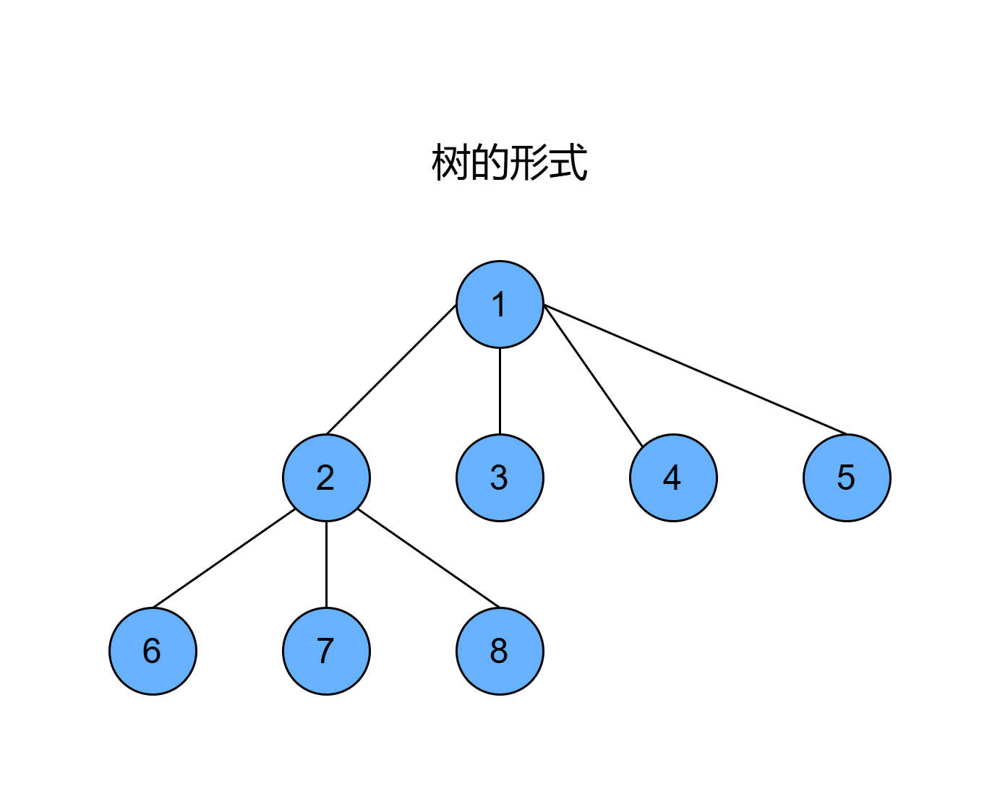

# 2. 二叉树

- 树的度小于等于二的时候，叫做二叉树。

## 2.1 树和二叉树的区别

- 二叉树中的结点的子树要区分为左子树和右子树。
- 即使结点只有一棵子树的情况下，也要明确区分出是该子树的左子树还是右子树。
- 在二叉树中，除叶结点外，其他所有结点都包含子结点和非空子树。

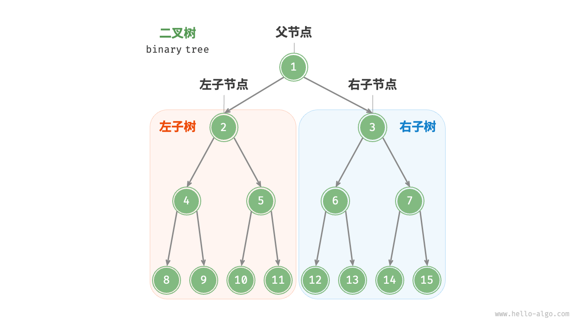

## 2.2 二叉树示例代码

```c++
/* 二叉树结点结构体 */
struct TreeNode {
    int val;          // 结点值
    TreeNode *left;   // 左子结点指针
    TreeNode *right;  // 右子结点指针
    TreeNode(int x) : val(x), left(nullptr), right(nullptr) {}
};

/* 初始化二叉树 */
// 初始化结点
TreeNode* n1 = new TreeNode(1);
TreeNode* n2 = new TreeNode(2);
TreeNode* n3 = new TreeNode(3);
TreeNode* n4 = new TreeNode(4);
TreeNode* n5 = new TreeNode(5);
// 构建结点之间的引用（指针）
n1->left = n2;
n1->right = n3;
n2->left = n4;
n2->right = n5;

/* 插入与删除结点 */
TreeNode* P = new TreeNode(0);
// 在 n1 -> n2 中间插入结点 P
n1->left = P;
P->left = n2;
// 删除结点 P
n1->left = n2;
// 释放内存
delete P;
```

## 2.3 不同的二叉树

### 2.3.1 完美二叉树/满二叉树

- **完美二叉树（perfect binary tree）** 所有层的结点都被完全填满。在完美二叉树中，叶结点的度为 0 ，其余所有结点的度都为 2 ；若树的高度为 h ，则结点总数为 2h+1−1 ，呈现标准的指数级关系，反映了自然界中常见的细胞分裂现象。

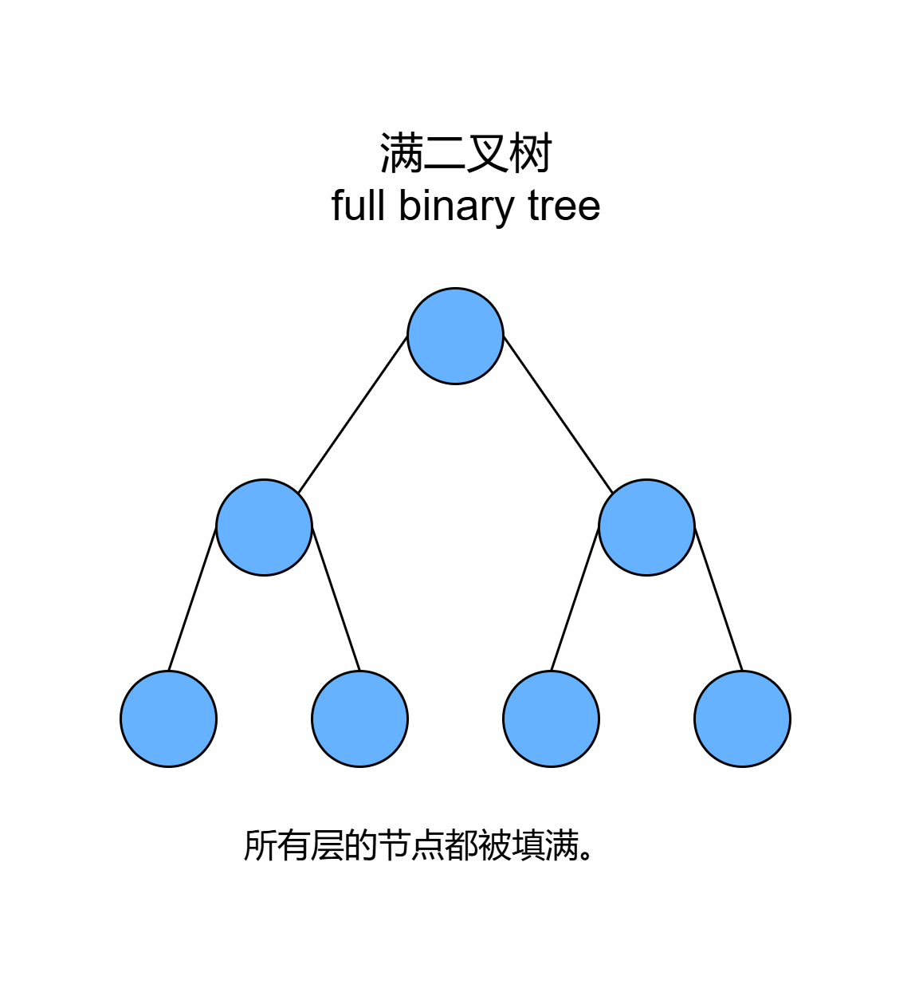

### 2.3.2 完全二叉树

- **完全二叉树（complete binary tree）** 只有最底层的结点未被填满，且最底层结点尽量靠左填充。

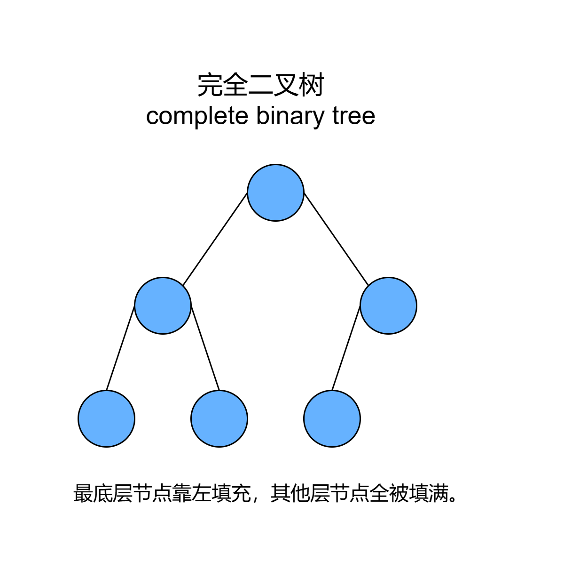

### 2.3.3 完满二叉树

- **完满二叉树（full binary tree）** 除了叶结点之外，其余所有结点都有两个子结点。

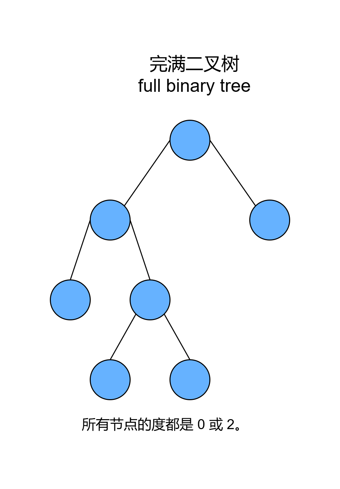

### 2.3.4 平衡二叉树

- **平衡二叉树（balanced binary tree）** 中任意结点的左子树和右子树的高度之差的绝对值不超过 1 。


### 2.3.5 二叉树退化为链表

- 当二叉树的每层结点都被填满时，达到“完美二叉树”；而当所有结点都偏向一侧时，二叉树退化为“链表”。 
- 完美二叉树是理想情况，可以充分发挥二叉树“分治”的优势。 
- 链表则是另一个极端，各项操作都变为线性操作，时间复杂度退化至 O(n) 

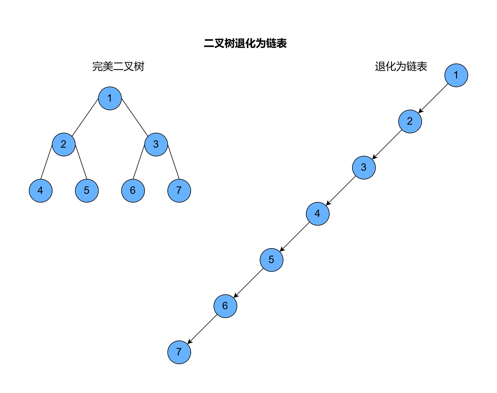

## 2.4 二叉树的特性

- 在二叉树的第 `i` 层上，最多有 `2i-1` 个结点(i>=1)。 
- 深度为 `k` 的二叉树最多有 `2k-1` 个结点(i>=1)。 
- 叶子结点数为 `n0` ，度为 `2` 的结点数为 `n2`，则 `n0=n2+1`。 
- 如果对一棵有 `n` 个结点的完全二叉树的结点按层序编号（从第1层到 `log2n+1` 层，每层从左到右），则对任一结点 `i(1<=i<=n)`，有： 
  - 如果 `i=1`，则结点 `i` 无父结点，是二叉树的根；如果 `i>1`，则父结点是 `i/2`。 
  - 如果 `2i>n`，则结点 `i` 为叶子结点，无左子结点；否则，其右子结点的结点是 `2i`。 
  - 如果 `2i+1>n`，则结点 `i` 无右子叶点，否则，其右子叶点是结点 `2i+1`。

# 3.二叉树的遍历

## 3.1 前序、中序、后序遍历

- **前序遍历**：先遍历根结点，再遍历左子树，最后遍历右子树。
- **中序遍历**：先遍历左子树，再遍历根结点，最后遍历右子树。
- **后序遍历**：先遍历左子树，在遍历右子树，最后遍历根结点。

```c++
/* 前序遍历 */
void preOrder(TreeNode *root) {
    if (root == nullptr)
        return;
    // 访问优先级：根结点 -> 左子树 -> 右子树
    vec.push_back(root->val);
    preOrder(root->left);
    preOrder(root->right);
}

/* 中序遍历 */
void inOrder(TreeNode *root) {
    if (root == nullptr)
        return;
    // 访问优先级：左子树 -> 根结点 -> 右子树
    inOrder(root->left);
    vec.push_back(root->val);
    inOrder(root->right);
}

/* 后序遍历 */
void postOrder(TreeNode *root) {
    if (root == nullptr)
        return;
    // 访问优先级：左子树 -> 右子树 -> 根结点
    postOrder(root->left);
    postOrder(root->right);
    vec.push_back(root->val);
}
```

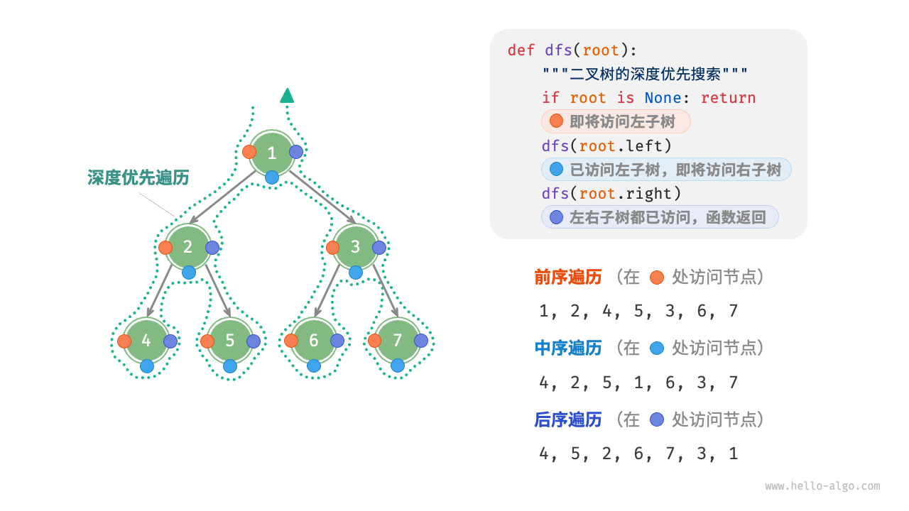

## 3.2 普通二叉树遍历示例

```text
       1
      / \
     2   3
    / \   \
   4   5   6
      /
     7
      \
       8

前序：1, 2, 4, 5, 7, 8, 3, 6
中序：4, 2, 7, 8, 5, 1, 3, 6
后序：4, 8, 7, 5, 2, 6, 3, 1
层序：1, 2, 3, 4, 5, 6, 7, 8
```

# 4. 二叉排序/查找树（Binary Search Tree, BST）

- **左子树小于根，右子树大于根。**
- **特点** 
  - 二叉查找树中的中序排列为从小打到排列的序列。 
  - 值最小的结点无左子树，值最大的结点无右子树。 
  - 每一层从左到右进行遍历的序列为从小到大排列的序列。

```text
         10
        /  \
       5    15
        \   / \
         7 12  18
        /       \
       6        20

前序：10, 5, 7, 6, 15, 12, 18, 20
中序：5, 6, 7, 10, 12, 15, 18, 20
后序：6, 7, 5, 12, 20, 18, 15, 10
```

# 5. 最优二叉树/哈夫曼树

## 5.1 哈夫曼树基本概念

- **树的路径长度**：从树根到树中每个**结点**的路径长度之和。 
- **权**：在一些应用中，赋予树中结点的一个有某种意义的实数。 
- **带权路径长度**：结点到树根之间的**路径长度**与该**结点上权的乘积**。 
- **树的带权路径长度（树的代价）**：树中所有叶结点的**带权路径长度之和**。 
- **构建哈夫曼树**： 
  - 构造森林全是根。 
  - 选用两小造新树。 
  - 删除两小添新人。 
  - 重复2、3剩单根。 
  - 左侧为小的值，右侧为大的值。
- **解析编码**：依据编码依次匹配，匹配到一个字符，就记录字符，使用剩余的字符继续匹配，直到匹配完毕。

## 5.2 构建哈夫曼树的例题1：对 `ABACCDA` 进行编码

- **例题：假设要传送的字符为：`ABACCDA`，目标：将这7个字符转换成由0、1构成的编码**。

### 5.2.1 方法1：使用等长的编码。

- **对应关系**：`A->00`，`B->01`，`C->10`，`D->11`。
- **结果**：`00010010101100`
- **缺点**：字符数量多，每一个字母的编码长度就会很长，总体的编码就很长，

### 5.2.2 方法2：使用不等长的编码。

- **对应关系**：`A->0`，`B->00`，`C->1`，`D->01`。 
- **结果**：`000011010` 
- **缺点**：可以编码，但是无法解码。 
- **设计不定长编码的时候，一定不能有重码，一个编码不能是其他码的前缀，这样才可以解码。**

### 5.2.3 方法3：构造哈夫曼树（节省空间、没有重码）

- 统计字符集中，每个字符在电文中出现的平均概率。（概率越大，要求编码越短。）
- 将每个字符的概率值作为权值，构造哈夫曼树。（利用哈夫曼树的特点：权值越大的叶子离根越近；概率大的结点，路径越短。）
- 在哈夫曼树的每个左分支标0，右分支标1，把从根到每个叶子结点路径上的标号连接起来，作为该叶子代表的字符编码，即哈夫曼树。

```text
    [ABDC:7]
    /     \
[A:3]     [BDC:4]
        /     \
    [C:2]     [BD:2]
              /     \
          [B:1]     [D:1]
```
- **编码结果**：`0 110 0 10 10 111 0` → `0110010101110`

## 5.3 构建哈夫曼树的例题2：对 `D={m, o, v, i, e}`，字符出现频率为 `w={2, 4, 2, 3, 3}` 构建哈夫曼树

### 5.3.1 开始

- 这些节点**按频率排序**（从小到大，频率相同时任意顺序）：节点列表：`[(m, 2), (v, 2), (i, 3), (e, 3), (o, 4)]`。
- 哈夫曼树的构建过程是**将频率最小的两个节点合并为一个新节点，新节点的频率为两者之和，然后将新节点放回列表，重新排序，重复此过程直到只剩一个节点**。

### 5.3.2 迭代 1：合并 `(m, 2)` 和 `(v, 2)` 为新节点

- 选择频率最小的两个节点：(m, 2) 和 (v, 2)
- 合并为新节点：N1 = (m + v, 2 + 2 = 4)
- 更新节点列表：[(i, 3), (e, 3), (o, 4), (N1, 4)]
- 排序：[(i, 3), (e, 3), (o, 4), (N1, 4)]

### 5.3.3 迭代 2：合并 `(i, 3)` 和 `(e, 3)` 为新节点

- 选择频率最小的两个节点：(i, 3) 和 (e, 3)
- 合并为新节点：N2 = (i + e, 3 + 3 = 6)
- 更新节点列表：[(o, 4), (N1, 4), (N2, 6)]
- 排序：[(o, 4), (N1, 4), (N2, 6)]

### 5.3.4 迭代 3：合并 `(o, 4)` 和 `(N1, 4)` 为新节点

- 选择频率最小的两个节点：(o, 4) 和 (N1, 4)
- 合并为新节点：N3 = (o + N1, 4 + 4 = 8)
- 更新节点列表：[(N2, 6), (N3, 8)]
- 排序：[(N2, 6), (N3, 8)]

### 5.3.5 迭代 4：合并 `(N2, 6)` 和 `(N3, 8)` 为新节点

- 选择仅剩的两个节点：(N2, 6) 和 (N3, 8)
- 合并为新节点：N4 = (N2 + N3, 6 + 8 = 14)
- 更新节点列表：[(N4, 14)]
- 此时，只剩一个节点，哈夫曼树构建完成，根节点为 N4，频率为 14。

```text
           N4(14)
          /      \
       N2(6)     N3(8)
       /  \      /  \
     i(3) e(3) o(4) N1(4)
                    /  \
                  m(2) v(2)
```

### 5.3.6 构建完成，开始分配编码

- 从根节点开始，**左子树分配 0，右子树分配 1**，遍历到每个叶子节点，得到每个字符的**哈夫曼编码**： 
- m：从根 N4 → N3 (右, 1) → N1 (右, 1) → m (左, 0) → 编码：110 
- v：从根 N4 → N3 (右, 1) → N1 (右, 1) → v (右, 1) → 编码：111 
- o：从根 N4 → N3 (右, 1) → o (左, 0) → 编码：10 
- i：从根 N4 → N2 (左, 0) → i (左, 0) → 编码：00 
- e：从根 N4 → N2 (左, 0) → e (右, 1) → 编码：01

### 5.3.7 编码结果

- m: 110 
- o: 10
- v: 111 
- i: 00 
- e: 01

### 5.3.8 加权路径长度（WPL）

- **WPL = Σ(频率 × 编码长度)**
- m: 2 × 3 = 6 
- o: 4 × 2 = 8 
- v: 2 × 3 = 6 
- i: 3 × 2 = 6 
- e: 3 × 2 = 6 
- **总和**：6 + 8 + 6 + 6 + 6 = 32

# 6. 平衡二叉树-AVL树

## 6.1 AVL树的定义

- **平衡二叉树**：是一种特殊的二叉树，要求任意一个结点的 **左子树和右子树的高度差（平衡因子）** 不超过 1。
- 保证树的高度为 `O(log n)`，从而保证查找、插入和删除操作的时间复杂度为 `O(log n)`。
- 进行插入、删除等操作时，可能会导致树的 **平衡因子失去平衡**，因此需要进行 **旋转操作来保持平衡**。
- 旋转之后，二叉树的中序遍历不变。
- **旋转总结**：
  - 左旋：向左旋转，冲突的左孩变右孩。
  - 右旋：向右旋转，冲突的右孩变左孩。

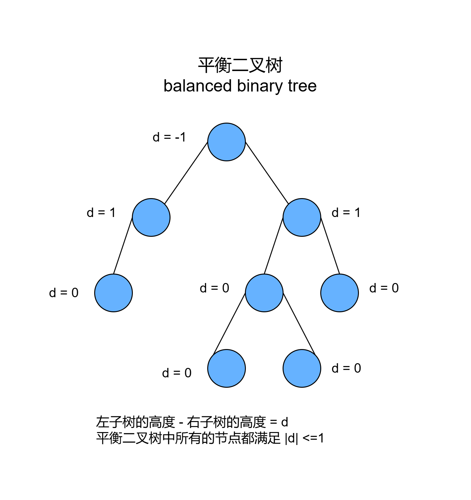

## 6.2 AVL树的左旋操作

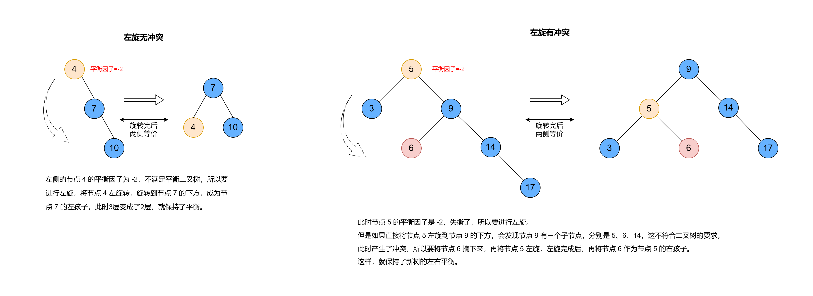

## 6.3 AVL树的右旋操作

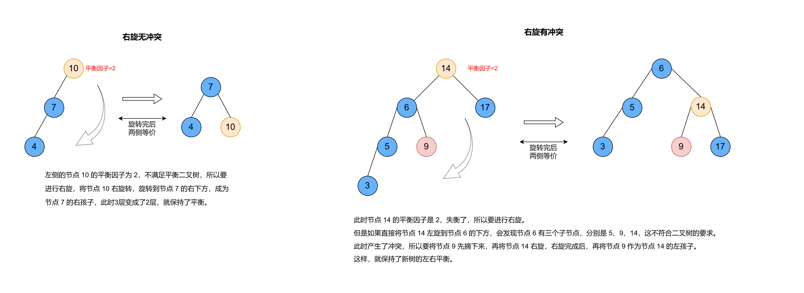

## 6.4 AVL树的插入操作引起旋转

### 6.4.1 插入左子树的左子树：LL 型

- **特点**：
  - 失衡节点的平衡因子是 2。
  - 失衡节点的左子树的平衡因子是 1。
- **操作**：
  - 对失衡节点进行右旋。

### 6.4.2 插入右子树的右子树：RR 型

- **特点**：
  - 失衡节点的平衡因子是 -2。
  - 失衡节点的右子树的平衡因子是 -1。
- **操作**：
  - 对失衡节点进行左旋。

### 6.4.3 插入左子树的右子树：LR 型

- **特点**：
  - 失衡节点的平衡因子是 2。
  - 失衡节点的左子树的平衡因子是 -1。
- **操作**
  - 先对失衡节点的左子树进行左旋，再对失衡节点进行右旋。（旋转左孩子，然后右旋）

### 6.4.4 插入右子树的左子树：RL 型

- **特点**：
  - 失衡节点的平衡因子是 -2。
  - 失衡节点的右子树的平衡因子是 1。
- **操作**
  - 先对失衡节点的右子树进行右旋，再对失衡节点进行左旋。（旋转右孩子，然后左旋）

### 6.4.5 AVL 树插入注意事项

- 插入节点后，如果导致多个祖先节点失衡，只需要调整距离插入节点最近的失衡节点，其他失衡节点会自动平衡。

### 6.4.6 AVL 树的构建过程

- 使用元素: `14, 9, 5, 17, 11, 12, 7, 19, 16, 27`，构建 AVL 树。

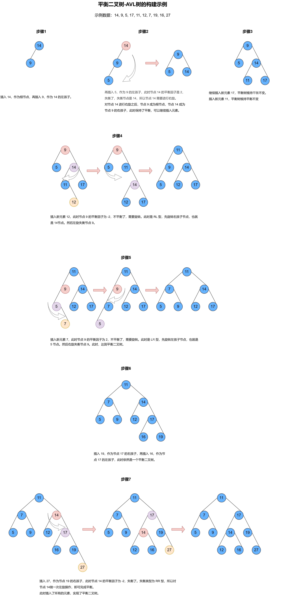

