# 1. 图

## 1.1 图是什么

- 图（graph）是一种**非线性数据结构**，由 **顶点（vertex）** 和 **边（edge）** 组成。我们可以将图 G 抽象地表示为一组顶点 V 和一组边
  E 的集合。地图就是一种图，每一个城镇可以看做一个顶点，链接城镇的道路就是边。
- **无向图**：图的节点之间连接线是**没有箭头**的，**不分方向**。
- **有向图**：图的节点之间**连接线是箭头，区分A到B，和B到A是两条线**。
- **完全图**：
    - 无向完全图中，**节点两两之间都有连线**，n 个节点的连线数为 `(n-1)+(n-2)+...+1=n*(n-1)/2`；
    - 向完全图中，**节点两两之间都有互通的两个箭头**，n个节点的连线数为 `n*(n-1)`。
- **度、出度和入度**：顶点的度是**关联与该顶点的边的数目**。在有向图中，顶点的度为出度和入度之和。
- **路径**：存在一条通路，可以从一个顶点到达另一个顶点。
- **子图**：有两个图G=(V,E)和G'=(V',E')，**如果V'⊆V且E'⊆E，则称G'为G的子图**。
- **连通图和连通分量**：无向图：若**从顶点v到顶点u之间是有路径的**
  ，则说明v和u之间是连通的，若无向图中任意两个顶点之间都是连通的，则称为连通图。无向图G的极大连通子图称为其连通分量。
- **强连通图和强连通分量**：有向图：若**有向图任意两个顶点间都互相存在路径**，即存在v到u，也存在u到v的路径，则称为强连通图。有向图中的极大连通子图称为其强连通分量。
- **网**：**边带权值的图称为网**。

## 1.2 图的分类示例图

### 1.2.1 无向图

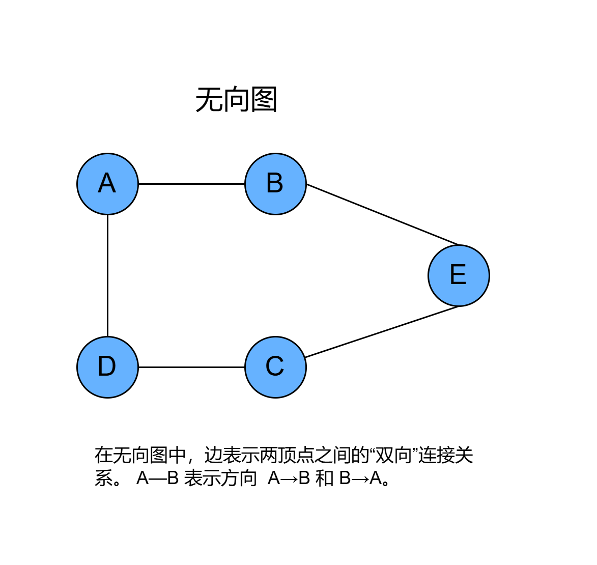

### 1.2.2 有向图

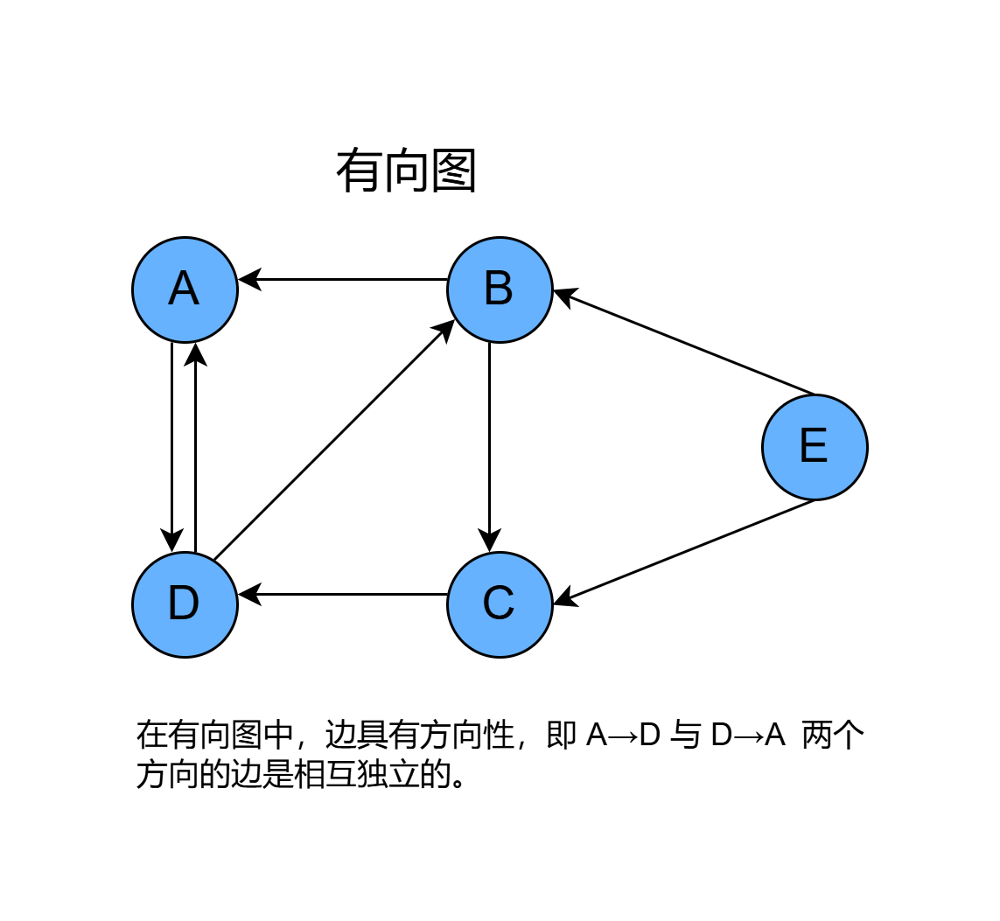

### 1.2.3 包含 5 个顶点和 7 条边的图

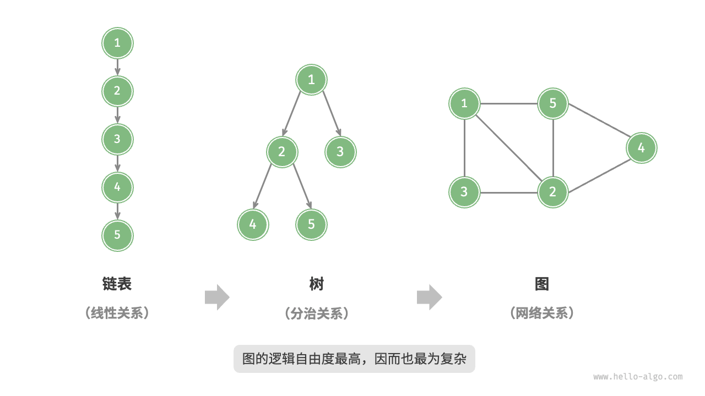


### 1.2.4 无向完全图

- 在无向图中，若每对顶点之间都有一条边相连，则称该图为完全图。
- n个顶点，构造无向完全图的边数是 n(n-1)/2。

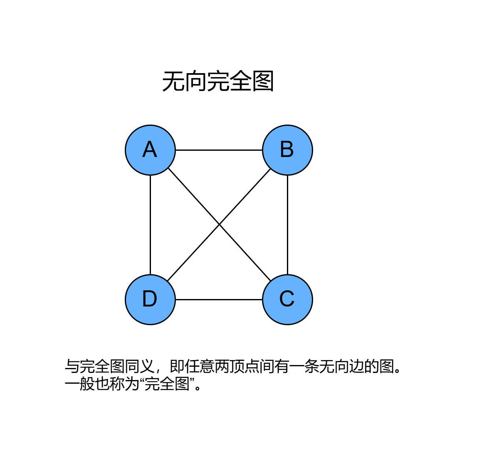

### 1.2.5 有向完全图

- 在有向图中，若每对顶点之间都有两条有向边相互连接，则称该图为完全图。
- n个顶点，构造有向完全图的边数是 n(n-1)。

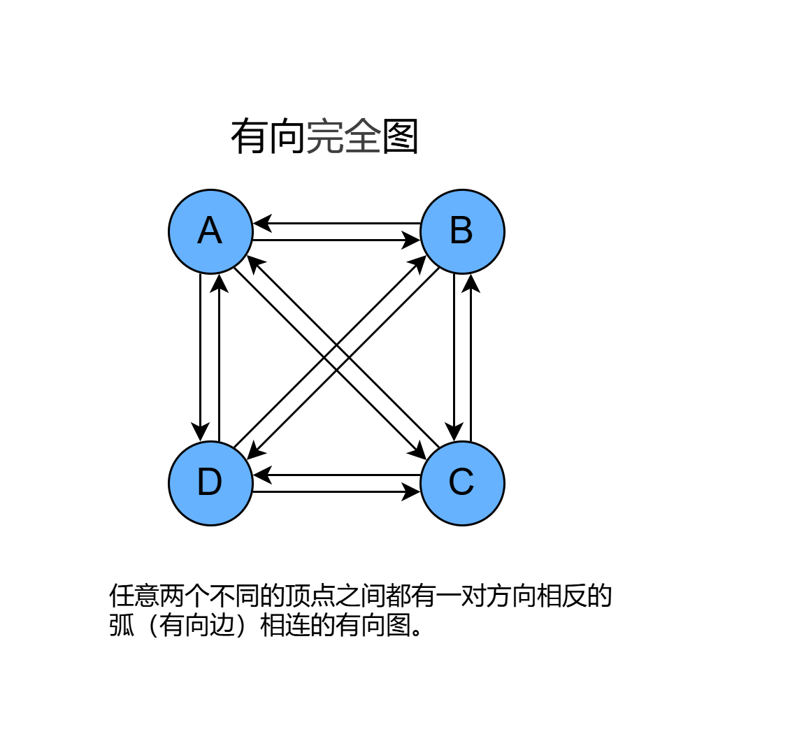

### 1.2.6 连通图、非连通图

- 根据所有顶点是否连通，可分为连通图（connected graph）和非连通图（disconnected graph）。
- 对于连通图，从某个顶点出发，可以到达其余任意顶点。即任意两个顶点之间都有一个路径相连。
- 对于非连通图，从某个顶点出发，至少有一个顶点无法到达。
- 完全图一定是连通图，连通图不一定是完全图。

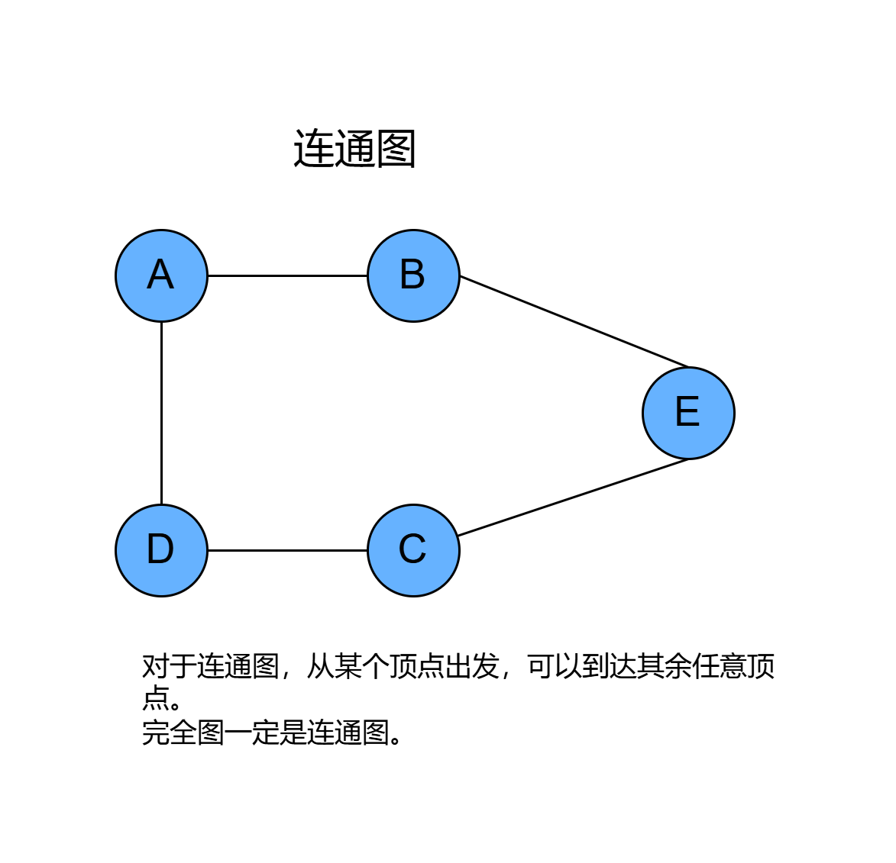

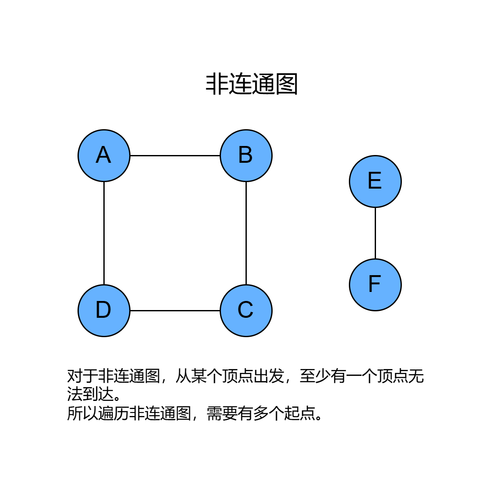

### 1.2.7 无权图、有权图

- 为边添加“权重”变量，从而得到有权图（weighted graph）。
    - 例如在《王者荣耀》等手游中，系统会根据共同游戏时间来计算玩家之间的“亲密度”，这种亲密度网络就可以用有权图来表示。

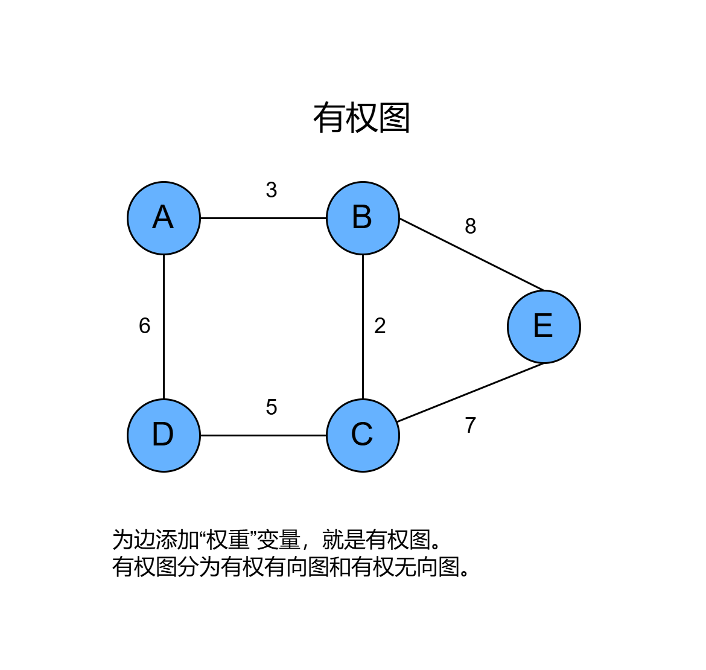

## 1.3  图转邻接矩阵、邻接表

### 1.3.1 邻接矩阵

- 在图论和计算机科学中，**邻接矩阵（adjacency matrix）**是一种**方阵**，用来表示**有限图**。它的每个元素代表**各点之间是否有边相连
  **。
- 邻接矩阵是一个**二维数组（矩阵）**，用于表示图中**顶点之间的连接关系**。
    - 对于一个包含 _n_ 个顶点的图，邻接矩阵是一个 _n*n_ 的矩阵，其中元素 _A[i][j]_ 表示从顶点 _i_ 到顶点 _j_ 是否有边连接。
- **优点**：
    - 判断两个顶点是否相邻（即是否有边连接）非常快速，时间复杂度为 _O(1)_。
    - 适用于**稠密图**（边的数量接近顶点数量的平方），因为**边的存储方式是通过矩阵直接表示的**。
- **缺点**：
    - **空间复杂度较高**，尤其是对于稀疏图，因为每对顶点都会有一个矩阵元素，不管它们之间是否有边。空间复杂度为 _O(n^2)_。
    - 存储和遍历每个顶点的邻接点时效率较低，尤其是当图的边比较少时。

### 1.3.2 邻接表

- 在图论和计算机科学中，**邻接表（adjacency list）** 是表示了 **图中与每一个顶点相邻的边集的集合**，这里的集合指的是**无序集
  **。
- **无向图，每条边由两个节点组成，分别代表边的两个端点.**
- **有向图，每条边是一个节点对，分别代表边的始点和终点。**

### 1.3.3 无向图转邻接矩阵、邻接表

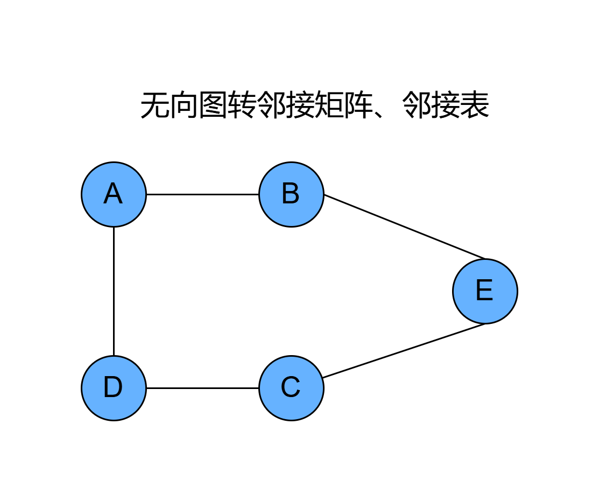

- **无向图转邻接矩阵**
    - **无向图**：无向图的邻接矩阵是对称的，因为边是双向的。
    - 如果存在从顶点 _i_ 到顶点 _j_ 的边，那么 _A[i][j]_=_A[j][i]_=1（或其他某个非零值）。
    - **无向图的邻接矩阵，是一个对称矩阵。**

```text
    A B C D E
A [ 0 1 1 0 0 ]
B [ 1 0 0 0 1 ]
C [ 1 0 0 1 0 ]
D [ 0 0 1 0 1 ]
E [ 0 1 0 1 0 ]
```

- **无向图转邻接表**
    - **邻接表**：把每个顶点的邻接顶点用链表示出来，然后用一个一位数组来顺序存储上面每一个链表的头指针。

```text
A: [B, C]
B: [A, E]
C: [A, D]
D: [C, E]
E: [B, D]
```

### 1.3.4 有向图转邻接矩阵、邻接表

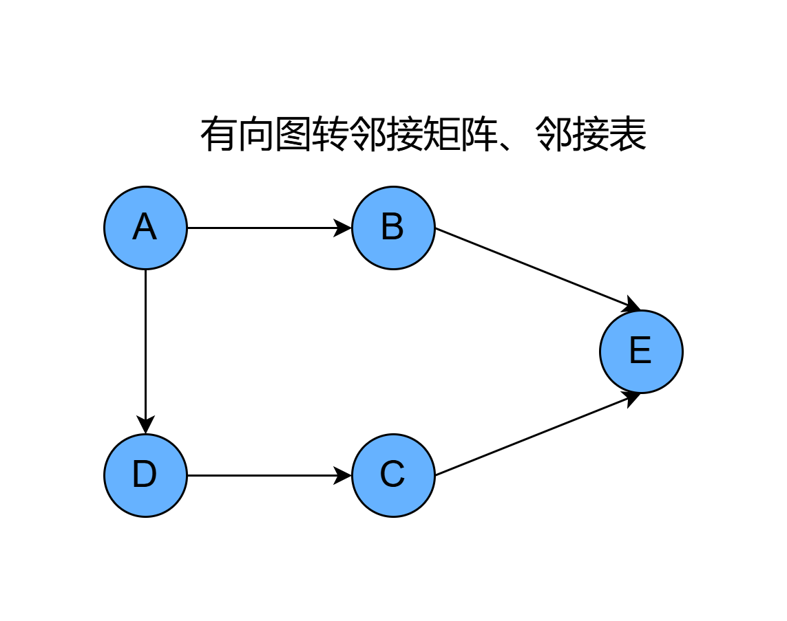

- **有向图转邻接矩阵**
    - **出度**：行i到其他顶点的边数。
    - **入度**：列j到某个顶点的边数。
    - 用一个 n 阶方阵 R 来存放图中各节点的关联信息，其矩阵元素 <i>R<sub>ij</sub></i> 定义为：
    - <i>R<sub>ij</sub></i> = 1 若顶点i到顶点j有邻接边
    - <i>R<sub>ij</sub></i> = 0 若顶点i到顶点j无邻接边
    - 矩阵 <i>R<sub>ij</sub></i> 表示R（行，列），比如 <i>R<sub>23</sub></i> 表示2行3列，即1。

```text
    A B C D E
A [ 0 1 1 0 0 ]
B [ 0 0 0 0 1 ]
C [ 0 0 0 1 0 ]
D [ 0 0 0 0 1 ]
E [ 0 0 0 0 0 ]
```

- **有向图转邻接表**

```text
A: [B, C]
B: [E]
C: [D]
D: [E]
E: []
```

## 1.4 图的遍历与排序

### 1.4.1 深度优先遍历(DFS, Depth First Search)：不撞南墙不回头

- 从图的一个节点开始出发，沿着图的边，尽可能深地访问每一个节点，直到无法继续向下时，才回溯到上一个节点并继续遍历。
- 从一个起始节点开始，访问该节点，然后递归地地访问与该节点相连的未访问的邻居节点，直到没有未访问的邻居为止。
- 通常使用栈实现。

- **无向图的深度优先遍历**

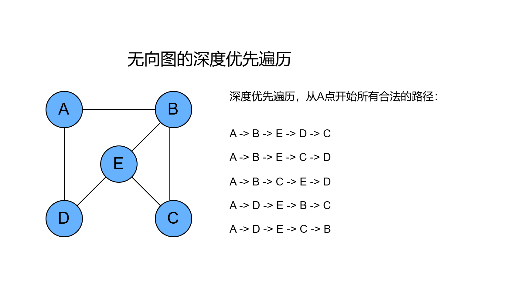

- **有向图的深度优先遍历**

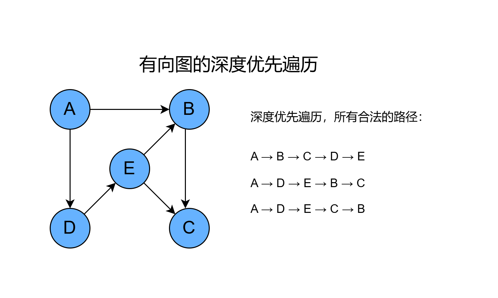

### 1.4.2 广度优先遍历(BFS, Breadth First Search)：层层扩散

- 从图的一个节点开始出发，沿着图的边，访问该节点的所有邻居节点，然后再访问这些邻居节点的邻居节点，逐层向外扩展，直到所有节点都被访问。
- 从一个起始节点开始，访问该节点，然后访问与该节点相连的所有未访问的邻居节点，接着按顺序访问这些邻居节点的邻居节点，直到没有未访问的邻居为止。
- 通常使用队列实现。

- **无向图的广度优先遍历**

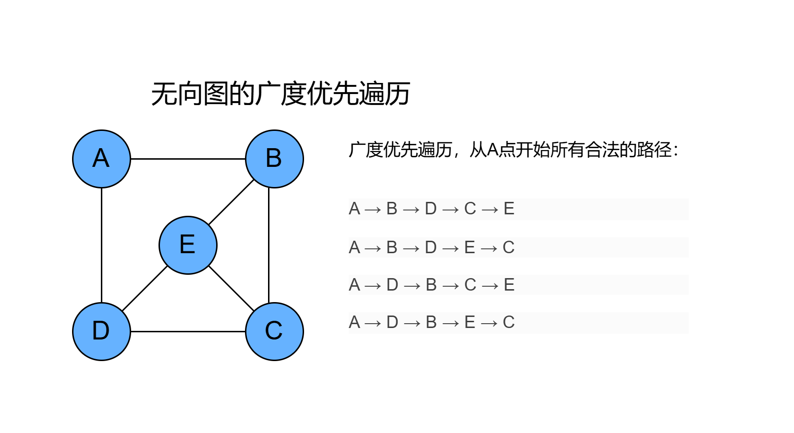

- **有向图的广度优先遍历**

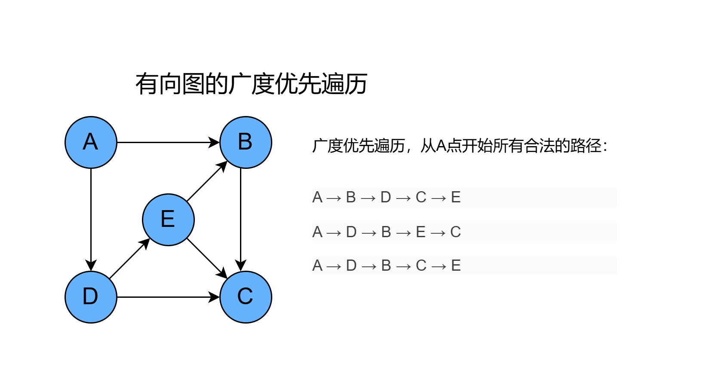

### 1.4.3 拓扑排序

- 所有点 **按照先后顺序排成序列**。 
- 要求 **有向无环图**。如果有环的话，那么去掉某一些点之后，剩下的点就没有入度为 0 的点了，就无法进行拓扑排序。
  - 反过来说，如果拓扑排序进行不下去，说明图中有环。
- 排序方式：每次选入度为 0 的点，然后删除这个点和它的出边。
- 示例：
  - 以 A 点出发，去掉所有出度的边，此时有 B 和 E 两个点的出度为 0。说明拓扑排序不是固定的，可能有多个。
  - 假设选择 E 点，去掉 E 点的出度边。然后再去掉 B 点的出度边。此时只剩下 D 的出度边为 0。
  - 去掉 D 点，此时只剩下 C 点的出度边为 0。
  - 再去掉 C 点，结束排序。
  - 此时的拓扑顺序为：`A -> E -> B -> D -> C`

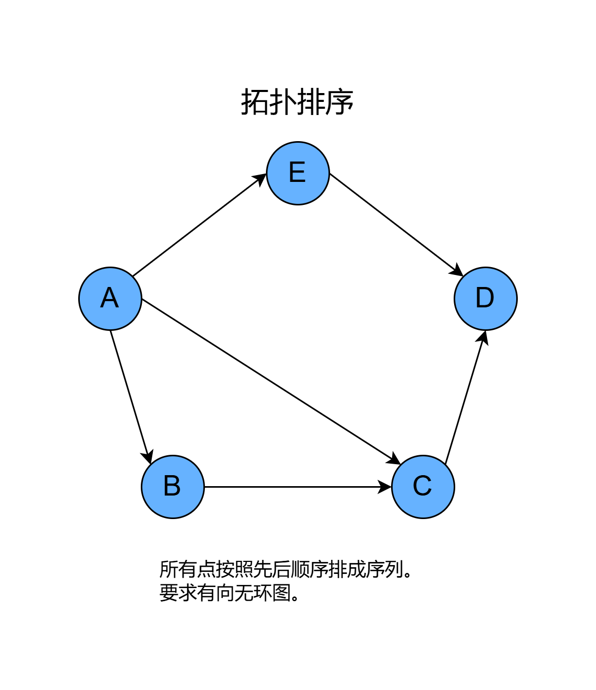


## 1.5 图的常见应用

| 领域     | 顶点       | 边             | 图计算问题               | 权重的实际场景                            |
|--------|----------|---------------|---------------------|------------------------------------|
| 社交网络   | 用户       | 好友关系          | 潜在好友推荐              | 权重表示用户间互动频率（如消息数量），用于推荐更可能成为好友的用户。 |
| 地铁线路   | 站点       | 站点间的连通性       | 最短路径推荐              | 权重表示站点间距离（公里）或时间（分钟），帮助计算最优或最短路径。  |
| 太阳系    | 星体       | 星体间的万有引力作用    | 行星轨道计算              | 权重表示引力大小（基于质量和距离），用于模拟轨道运动。        |
| 互联网    | 网页       | 网页间的超链接       | 网页排名（如 PageRank 算法） | 权重表示超链接的重要性（如点击率），影响网页排名的优先级。      |
| 物流与供应链 | 仓库/配送点   | 配送点间的运输路线     | 最优配送路径规划（如 TSP 问题）  | 权重表示运输成本（金钱）或时间，帮助优化配送路径以降低成本。     |
| 生物信息学  | 基因/蛋白质   | 基因间的相互作用      | 基因网络分析（如疾病相关基因预测）   | 权重表示相互作用的强度（如相关系数），用于识别关键基因。       |
| 计算机网络  | 路由器/设备   | 设备间的网络连接      | 网络流量优化、最短路径路由       | 权重表示带宽或延迟，帮助选择最快的或最稳定的路由路径。        |
| 推荐系统   | 用户/商品    | 用户对商品的购买/评分   | 商品推荐（如协同过滤）         | 权重表示评分值或购买频率，衡量用户对商品的偏好程度。         |
| 知识图谱   | 实体（如人、物） | 实体间的关系（如“属于”） | 语义推理（如问答系统）         | 权重表示关系的可信度（如置信度分数），提高推理结果的准确性。     |
| 游戏设计   | 地图上的地点   | 地点间的可达路径      | 路径规划（如 NPC 移动）      | 权重表示路径的难度（如地形成本），帮助 NPC 选择最优移动路径。  |
| 电路设计   | 电路元件     | 元件间的电连接       | 电路优化（如最小生成树）        | 权重表示电阻值或功耗，优化电路以减少能量损失。            |


# 2. 图的算法

## 2.1 最小生成树

### 2.1.1 最小生成树概念

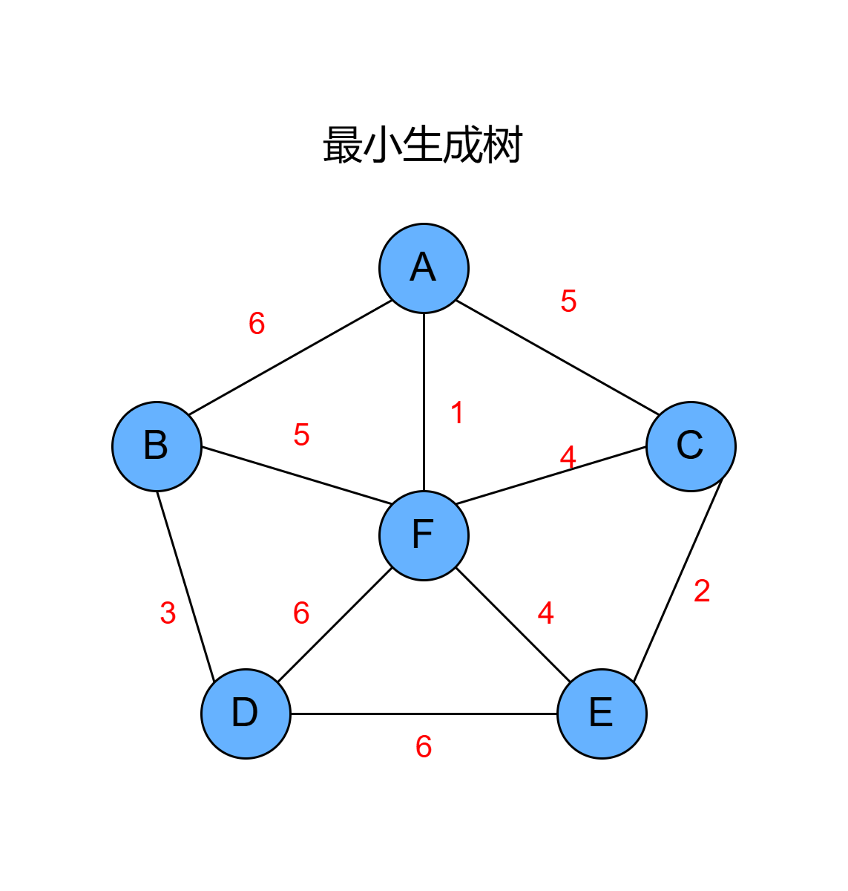

- 最小生成树是在一个有权无向图里，**选出一部分边，使得所有的顶点都连通，并且边的权值之和最小**。
- 最小生成树的形状可能不一样，但是最终的边权和一定是固定的。

### 2.1.2 Prim 普里姆算法

- 从一个顶点开始，逐步扩展树的节点，每次选择一条 **连接已选顶点集合和未选顶点集合之间权值最小的边**。
- 特点：
  - 适用于 **稠密图（边多）**。 
  - 通常使用 **优先队列（最小堆）** 实现以提高效率。

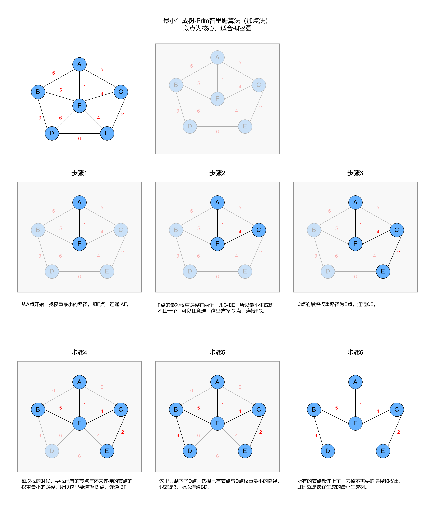


### 2.1.3 Kruskal 克鲁斯卡尔算法

- 从最小边开始，**每次选择一条权值最小的边，只要不会形成环，就加入生成树**，直到形成一个包含所有顶点的生成树。
- 特点： 
  - 适用于 稀疏图（边少）。 
  - 实现简单，依赖于并查集结构。

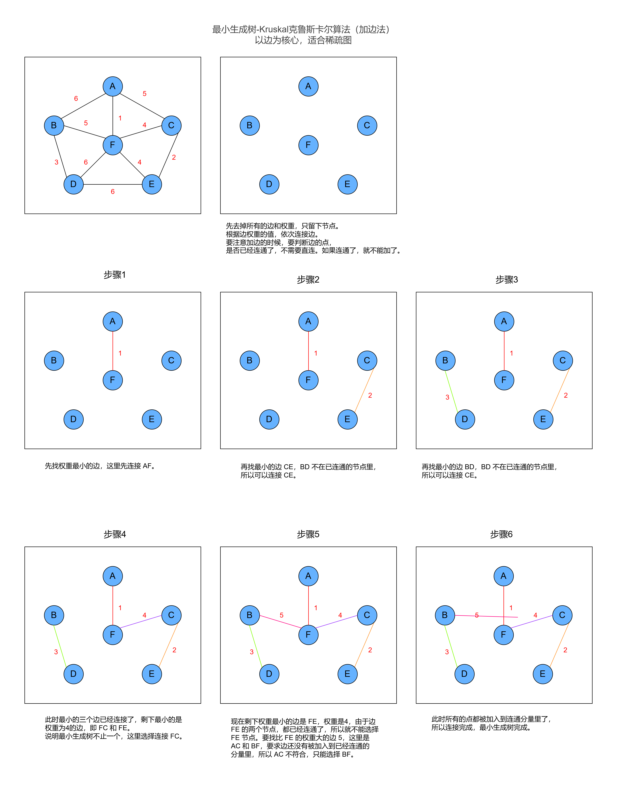

## 2.2 最短路径问题

### 2.2.1 最短路径问题概念

- 最短路径是指在一个有权图里，从一个顶点到其他所有顶点里，**路径权值最小的路径**。也被称为 **单源最短路径问题**。

### 2.2.2 Dijkstra 迪杰斯拉特算法

- **核心思想**：
  - **初始化**：首先将源点的最短路径设为0，其他点的最短路径设为无穷大（表示未访问）。
  - **选择最短路径的节点**：每次选择一个当前距离源点最近的节点，并更新该节点的邻接节点的最短路径。 
  - **更新路径**：通过当前节点来更新其邻接节点的最短路径。 
  - **重复步骤**：重复选择未处理节点中距离源点最小的节点，直到所有节点都被处理完。

- **适用场景**：适用于稠密图（边多），但不适用于负权边的图。

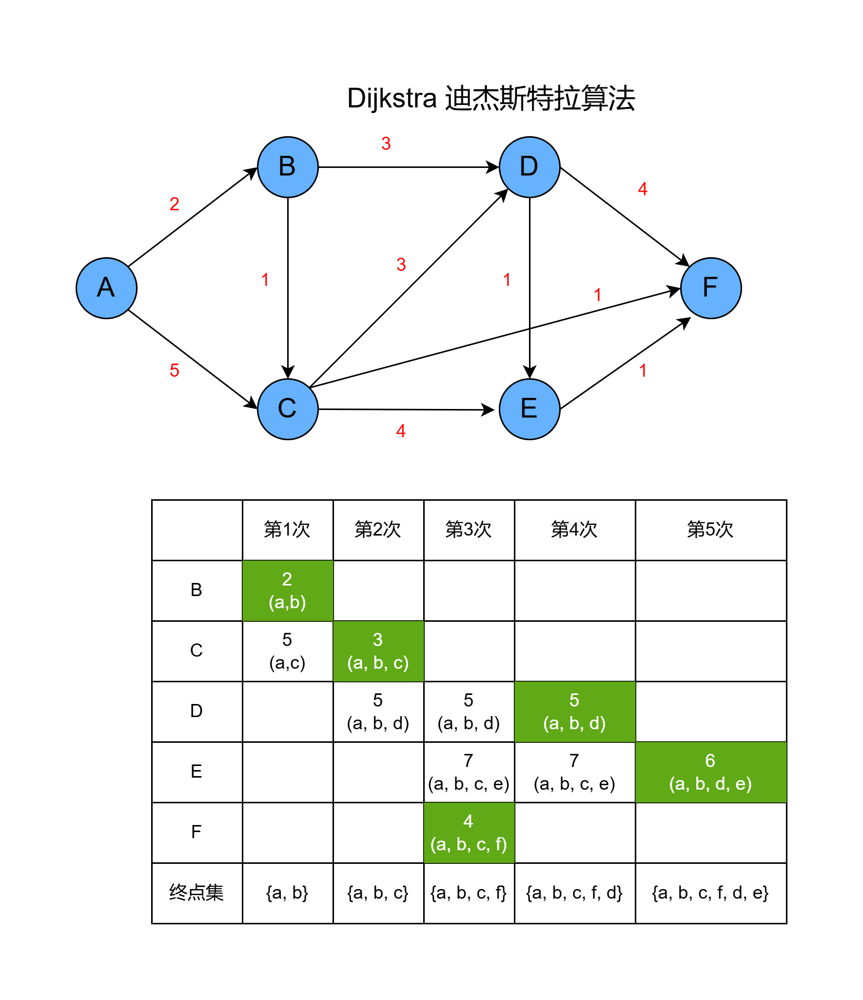