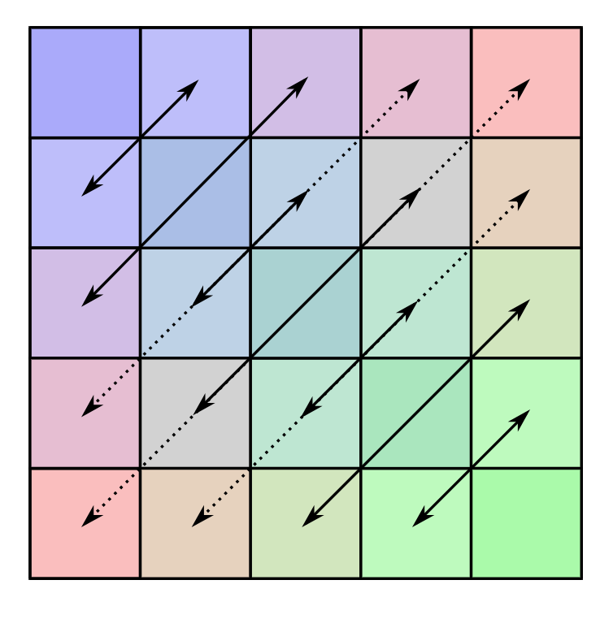

# 矩阵 Matrix

- 如何在 markdown 里写矩阵：https://xujinzh.github.io/2020/11/24/markdown-matrix/index.html

# 1. 矩阵

## 1.1 基本概念

- **奇异矩阵**：是指行列式为0的矩阵。
- **单位矩阵**：单位矩阵是一个方阵，如果主对角线上的元素都为1，其余元素都为0，则称其为单位矩阵。
- **转置矩阵**：
  - 矩阵 $A$ 的转置矩阵 $A^T$ 是一个矩阵，其第 $i$ 行第 $j$ 列的元素等于矩阵 $A$ 的第 $j$ 行第 $i$ 列的元素。
  - 矩阵的转置是一个线性变换。
  - 矩阵的转置是可逆的，且 $(A^T)^{-1} = (A^{-1})^T$。
  - $(A^T)^T = A$

## 1.2 矩阵的逆

- **矩阵的逆**：存在一个方阵 $A$，如果存在一个矩阵 $A^{-1}$ ，使得 $AA^{-1} = A^{-1}A = I$，则称 $A$ 是可逆矩阵，$A^{-1}$ 是 $A$ 的逆矩阵。
- **矩阵存在的条件**：
  - 只有方阵才会有逆矩阵。
  - 奇异矩阵没有逆矩阵。
- **逆矩阵的性质**：
  - 单位矩阵的逆矩阵是单位矩阵本身。 $I^{-1} = I$。
  - 矩阵的乘积：如果矩阵 $A$ 和 $B$ 都是可逆矩阵，则它们的乘积 $AB$ 也是可逆矩阵，且 $(AB)^{-1} = B^{-1}A^{-1}$。
  - 转置矩阵的逆：如果矩阵 $A$ 是可逆矩阵，则它的转置矩阵 $A^T$ 也是可逆矩阵，且 $(A^T)^{-1} = (A^{-1})^T$。
  - 逆矩阵的逆：逆矩阵的逆矩阵是原矩阵本身，即 $(A^{-1})^{-1} = A$。
  - 对角矩阵的逆：如果矩阵 $A$ 是对角矩阵，则它的逆矩阵也是对角矩阵，且对角线上的元素是原矩阵对角线上的元素的倒数。

# 2. 矩阵的加法

## 2.1 矩阵的加法概念

- 加法的条件：矩阵 $A$ 加上 矩阵 $B$，要求两个矩阵必须有相同的维度，即矩阵 $A$ 和矩阵 $B$ 的行数和列数必须相同。
- 假设矩阵 $A$ 为 $m × n$ 的矩阵，矩阵 $B$ 也是 $m × n$ 的矩阵，则它们的和 $C = A + B$ 也是一个 $m × n$ 的矩阵。

## 2.2 矩阵加法运算律

- 交换律：$A$ + $B$ = $B$ + $A$
- 结合律：($A$ + $B$) + $C$ = $A$ + ($B$ + $C$)
- 零矩阵的加法恒等式：$A$ + $0$ = $A$
- 加法逆元：$A$ + (-$A$) = $0$

## 2.3 矩阵加法的计算示例

- 计算矩阵加法：设有两个矩阵 $A$ 和 $B$，它们的维度均为 $3 × 3$，如下所示：

$$
A = \left[
\begin{matrix}
1 & 2 & 3 \\
4 & 5 & 6 \\
7 & 8 & 9
\end{matrix}
\right]，
B = \left[
\begin{matrix}
9 & 8 & 7 \\
6 & 5 & 4 \\
3 & 2 & 1
\end{matrix}
\right]
$$

- 矩阵加法步骤：

$$
C = \left[
\begin{matrix}
1 + 9 & 2 + 8 & 3 + 7 \\
4 + 6 & 5 + 5 & 6 + 4 \\
7 + 3 & 8 + 2 & 9 + 1
\end{matrix}
\right]
= \left[
\begin{matrix}
10 & 10 & 10 \\
10 & 10 & 10 \\
10 & 10 & 10
\end{matrix}
\right] \tag{5}
$$

# 3. 矩阵的乘法

## 3.1 矩阵的乘法概念

- 乘法的条件：矩阵 $A$ 和矩阵 $B$ 的乘法要求矩阵 $A$ 的列数等于矩阵 $B$ 的行数。
- 假设矩阵 $A$ 为 $m × p$ 的矩阵，矩阵 $B$ 为 $p × n$ 的矩阵，则它们的乘积 $C = AB$ 是一个 $m × n$ 的矩阵。

## 3.2 矩阵乘法运算律

- **矩阵数乘运算律**
  - 分配律：$kA$ + $kB$ = $k$($A$ + $B$)
  - 结合律：$k(vA)$ = $v(kA)$
  - 分配律：$(k + v)A$ = $kA$ + $vA$
- **矩阵乘法运算律**
  - 不满足交换律：$AB$ != $BA$
  - 结合律：$A(BC)$ = $(AB)C$
  - 分配律：$A(B + C)$ = $AB + AC$，$(A + B)C$ = $AC$ + $BC$

## 3.3 矩阵的数乘例子

- 矩阵数乘是指将一个矩阵的每个元素都乘以一个常数（标量），得到一个新的矩阵。
- 例如，设有一个矩阵 $A$，它的维度为 $3 × 3$，如下所示：

$$
A = \left[
\begin{matrix}
1 & 2 & 3 \\
4 & 5 & 6 \\
7 & 8 & 9
\end{matrix}
\right]
$$

#

$$
2A = \left[
\begin{matrix}
2 \times 1 & 2 \times 2 & 2 \times 3 \\
2 \times 4 & 2 \times 5 & 2 \times 6 \\
2 \times 7 & 2 \times 8 & 2 \times 9
\end{matrix}
\right]
= \left[
\begin{matrix}
2 & 4 & 6 \\
8 & 10 & 12 \\
14 & 16 & 18
\end{matrix}
\right]
$$

## 3.4 矩阵相乘例子

- 矩阵相乘是指将一个矩阵与另一个矩阵进行乘法运算，得到一个新的矩阵。
- 例如，设有两个矩阵 $A$ 和 $B$，它们的维度分别为 $2 × 3$ 和 $3 × 2$，如下所示：

$$
A = \left[
\begin{matrix}
1 & 2 & 3 \\
4 & 5 & 6
\end{matrix}
\right]
，
B = \left[
\begin{matrix}
7 & 8 \\
9 & 10 \\
11 & 12
\end{matrix}
\right]
$$

$$
C = \left[
\begin{matrix}
(1 \times 7 + 2 \times 9 + 3 \times 11) & (1 \times 8 + 2 \times 10 + 3 \times 12) \\
(4 \times 7 + 5 \times 9 + 6 \times 11) & (4 \times 8 + 5 \times 10 + 6 \times 12)
\end{matrix}
\right]
= \left[
\begin{matrix}
58 & 64 \\
139 & 154
\end{matrix}
\right]
$$

# 4. 特殊矩阵

- 特殊矩阵：上三角矩阵、下三角矩阵、对角矩阵、对称矩阵、反对称矩阵、稀疏矩阵。
- 矩阵相关文档：https://csgraduates.com/data_structure/array/matrix/

## 4.1 上三角矩阵

上三角矩阵是是一个方阵，其主对角线及其以上（左上部分）的所有元素都不为零，而主对角线以下的所有元素都为常数。

$$
\text{上三角矩阵} = \left[
\begin{matrix}
1 & 2 & 3 & 4 & 5 & 6 \\
0 & 7 & 8 & 9 & 10 & 11 \\
0 & 0 & 12 & 13 & 14 & 15 \\
0 & 0 & 0 & 16 & 17 & 18 \\
0 & 0 & 0 & 0 & 19 & 20 \\
0 & 0 & 0 & 0 & 0 & 21
\end{matrix}
\right]
$$

## 4.2 下三角矩阵

下三角矩阵也是一个方阵，其主对角线及其以下（右下部分）的所有元素都不为零，而主对角线以上的所有元素都为零。

$$
\text{下三角矩阵} = \left[
\begin{matrix}
1 & 0 & 0 & 0 & 0 & 0 \\
2 & 3 & 0 & 0 & 0 & 0 \\
4 & 5 & 6 & 0 & 0 & 0 \\
7 & 8 & 9 & 10 & 0 & 0 \\
11 & 12 & 13 & 14 & 15 & 0 \\
16 & 17 & 18 & 19 & 20 & 21
\end{matrix}
\right]
$$

## 4.3 对角矩阵

矩阵中的非零元素，都集中在以主对角线为中心的带状区域中 。

$$
\text{对角矩阵} = \left[
\begin{matrix}
1 & 0 & 0 & 0 & 0 & 0 \\
0 & 2 & 0 & 0 & 0 & 0 \\
0 & 0 & 3 & 0 & 0 & 0 \\
0 & 0 & 0 & 4 & 0 & 0 \\
0 & 0 & 0 & 0 & 5 & 0 \\
0 & 0 & 0 & 0 & 0 & 6
\end{matrix}
\right]
$$

## 4.4 对称矩阵

对于矩阵 <strong>A</strong> 中的任意一个元素 <em>ai,j</em>，都有：

<em>ai,j = aj,i</em>。

$$
\text{对称矩阵} = \left[
\begin{matrix}
1 & 2 & 3 & 4 & 5 & 6 \\
2 & 7 & 8 & 9 & 10 & 11 \\
3 & 8 & 12 & 13 & 14 & 15 \\
4 & 9 & 13 & 16 & 17 & 18 \\
5 & 10 & 14 & 17 & 19 & 20 \\
6 & 11 & 15 & 18 & 20 & 21
\end{matrix}
\right]
$$

## 4.5 反对称矩阵

如果一个 <strong>n × n</strong> 的矩阵 <strong>An×n</strong> 中的元素满足：
<em>ai,j = -aj,i</em>，
那么称其为<strong>反对称矩阵</strong>。

$$
\text{反对称矩阵} = \left[
\begin{matrix}
0 & 1 & -2 & 3 & -4 & 5 \\
-1 & 0 & 6 & -7 & 8 & -9 \\
2 & -6 & 0 & 10 & -11 & 12 \\
-3 & 7 & -10 & 0 & 13 & -14 \\
4 & -8 & 11 & -13 & 0 & 15 \\
-5 & 9 & -12 & 14 & -15 & 0
\end{matrix}
\right]
$$

## 4.6 稀疏矩阵

稀疏矩阵中非零元素的个数相比矩阵元素的总个数非常少，且非零元素分布没有规律。

对于稀疏矩阵，存储非零元素时，必须同时存储其位置（行号和列号），

所以三元组 <em>(i, j, ai,j)</em> 可以唯一确定矩阵中的一个元素。

$$
\text{稀疏矩阵} = \left[
\begin{matrix}
0 & 0 & 0 & 4 & 0 \\
0 & 0 & 0 & 0 & 5 \\
0 & 3 & 0 & 0 & 0 \\
6 & 0 & 0 & 0 & 0 \\
0 & 0 & 0 & 0 & 7
\end{matrix}
\right]
$$

## 4.7 稠密矩阵

稠密矩阵（Dense Matrix）是指大部分元素为非零的矩阵。

$$
\text{稠密矩阵} = \left[
\begin{matrix}
1 & 2 & 3 & 4 & 5 & 6 \\
7 & 8 & 9 & 10 & 11 & 12 \\
13 & 14 & 15 & 16 & 17 & 18 \\
19 & 20 & 21 & 22 & 23 & 24 \\
25 & 26 & 27 & 28 & 29 & 30 \\
31 & 32 & 33 & 34 & 35 & 36
\end{matrix}
\right]
$$

## 4.8 单位矩阵

单位矩阵是主对角线为 1，其它元素为 0 的矩阵。

$$
\text{单位矩阵} = \left[
\begin{matrix}
1 & 0 & 0 & 0 & 0 & 0 \\
0 & 1 & 0 & 0 & 0 & 0 \\
0 & 0 & 1 & 0 & 0 & 0 \\
0 & 0 & 0 & 1 & 0 & 0 \\
0 & 0 & 0 & 0 & 1 & 0 \\
0 & 0 & 0 & 0 & 0 & 1
\end{matrix}
\right]
$$
