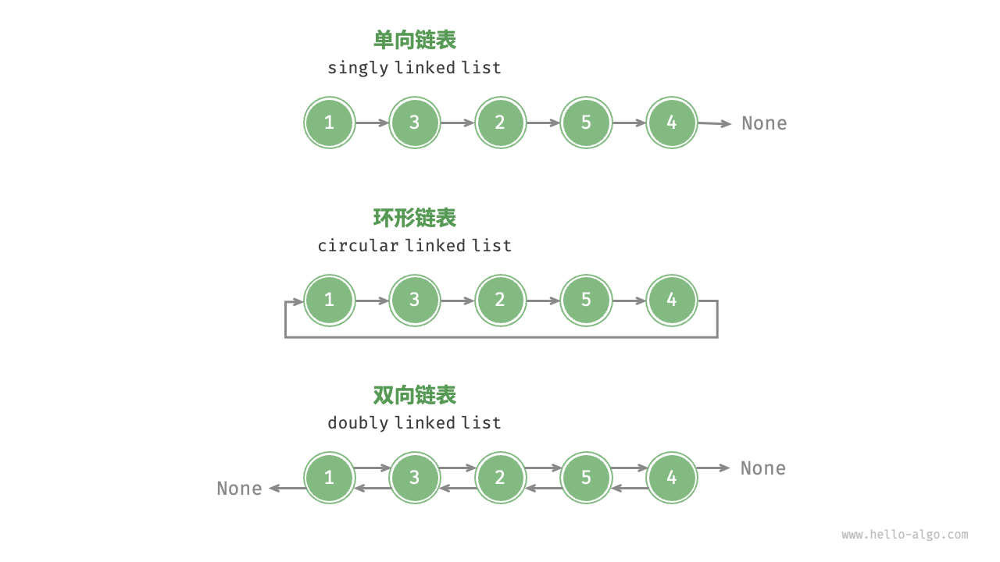
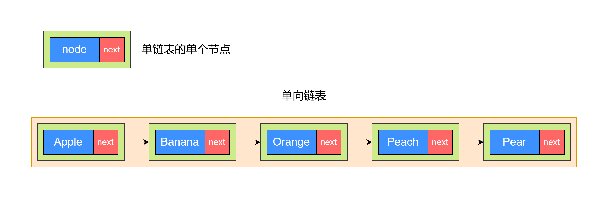
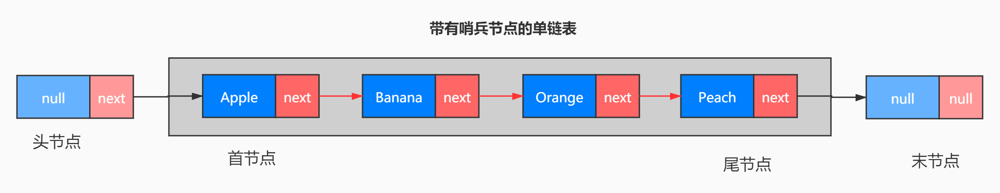

# 1. 链表

## 1.1 什么是链表？

- 链表是一种典型的**动态存储结构**，里边的数据由一系列的节点 `node` 组成，**每一个节点通过指针互相索引和访问**，而节点则由指针和节点所在的数据组成，查看下边的示例。
- 链表的设计使得各个节点可以分散存储在内存各处，它们的**内存地址无须连续**。

```c++
struct node {
    init data;
    struct node* next;
}
```

```java
public class LinkedListNode<T> {
  public T data;
  
  public LinkedListNode next;
}
```

```javascript
class Node {
  constructor(value) {
    this.value = value;
    this.next = null;
  }
}
```

## 1.2 常见的链表类型

- **单向链表**：即前面介绍的普通链表。单向链表的节点包含值和指向下一节点的引用两项数据。我们将首个节点称为头节点，将最后一个节点称为尾节点，尾节点指向空 None 。
- **双向链表**：与单向链表相比，双向链表记录了两个方向的引用。双向链表的节点定义同时包含指向后继节点（下一个节点）和前驱节点（上一个节点）的引用（指针）。相较于单向链表，双向链表更具灵活性，可以朝两个方向遍历链表，但相应地也需要占用更多的内存空间。
- **环形链表**：如果我们令单向链表的尾节点指向头节点（首尾相接），则得到一个环形链表。在环形链表中，任意节点都可以视作头节点。



## 1.3 单链表

- 通过不同语言的节点示例，可以看到每一个节点都有一个 `next` 属性，这个属性就是下一个节点的指针，就是指向下一个节点。
- 但是严格来看链表的定义里有 **互相索引和访问** 这个特点，互相索引所表达的意思应该是下一个节点可以访问上一个节点，下一节点可以访问上一个节点，示例里的节点只有一个 `next` 指针，只能指向下一个节点，不能指向上一个节点，这种链表叫做**单链表**，就是**单向链接**。
- 实际上，对于单链表来说，可以没有 `next` 属性，可以只有 `prev`，也就是不需要指向下一个节点，只需要指向上一个节点就可以了，这样的链表也是单向链表。



# 2. 如何使用链表？

链表的特点是由一个一个的节点组成，而每一个节点仅仅与它的前一个节点和后一个节点有关系，而与其他位置的节点没有关系。那么换一句话说，如果说一个链表里的某一个节点指向下一个节点的指针指歪了，就是指错了，那么这个链表就歪到茄子地里去了。所以我们在修改节点的上一个和下一个指针指向的时候，一定要注意，不能指向错误，不然就是失之毫厘谬以千里。

说的专业一些，节点的前一个节点叫做该**节点的前驱(predecessor)**，后一个节点叫做该**节点的后继(succeed)**。

## 2.1 链表的首节点有没有前驱节点？或者说首节点能不能有前驱节点？为什么？

这个问题换成尾节点(最后一个节点)就是，尾节点有没有后继节点？或者说尾节点能不能有后继节点？为什么？

答案是可以有，也可以没有。



看这个图，灰色区域为链表的实际数据区域，而灰色区域外的两个节点是链表的两个哨兵，我们可以对这两个哨兵节点进行内部封装，使其对外部不可见。这样就可以保证链表的实际数据区域里每一个节点都有后继节点，如果是双链表的话，就是既有前驱节点，又有后继节点。但是这两个**哨兵节点都不存储值，他们的值一直都是 null**。

## 2.2 使用哨兵有什么好处？一定要使用哨兵吗？

使用了哨兵之后，对于外部而言，链表内部的**每一个元素都有前驱节点和后继节点**，所以在访问每一个节点的时候，不需要考虑是否边界问题，避免出错，可以简化算法。而且**哨兵节点不参与具体的业务数据**。

虽然说哨兵节点也占用了两个内存空间，但是这两个节点的存储成本，远远低于由此带来的便利性，所以可以忽略不计。

所以我们不一定要用哨兵节点，这是一个取舍问题，不是是非问题。

## 2.3 如何添加元素和删除元素？


- **删除 Orange 节点**


我们可以看上边单链表这张图，链表里一共有 4 个元素，从前往后分别是 `Apple -> Banana -> Orange -> Peach`，所以 `Apple` 节点是首节点，`Peach` 是尾节点。此时我们的需求是删除 `Orange` 节点，预期是这样的 `Apple -> Banana -> Peach`。

由于链表是从前往后链接形成的，我们只能通过前一个节点的 next 指针，才能知道下一个节点的信息。换一句话说就是，我们不能通过第一个节点就直接知道第三个节点的信息，无论第三个节点的值是什么，或者是第三个节点是否存在。

因此，链表这样节点之间互相连接的特点，以致于我们不能直接像数组那样直接通过索引访问。如果我们要访问链表的第三个节点，必须先知道链表的第二个节点，而要知道第二个节点，就必须要通过首节点。

我们要删除 `Orange` 节点，这就有两个可能性，第一种是链表中确实有 `Orange` 节点，另一种可能性是没有 `Orange` 节点。然而无论链表中是否有 `Orange` 节点，我们都需要从首节点的 next 指针，不断的通过 next 找下一个节点，判断下一个节点的值是否为 `Orange`，如果是 `Orange`，那么就删除 `Orange` 节点。如果到尾节点都没有找到 `Orange` 节点，那么说明这个链表里没有 `Orange` 节点，也就不存在删除的问题了。

然而问题就在于，如果链表里有 `Orange` 节点，我们如何删除 `Orange` 节点？

操作很简单，我们只需要把 `Banana` 的 next 指向 `Peach`，同时把 Orange 的 next 指向修改为 null 即可。这样，`Banana` 的 next 就指向了 `Peach`，链表中就没有了 `Orange` 节点。

- **添加 Lemon 节点**


如果要添加新节点，比如原链表还是 `Apple -> Banana -> Orange -> Peach`，要把 `Lemon` 添加到 `Banana` 节点的后边，`Orange` 节点的前边，预期链表是这样的 `Apple -> Banana -> Lemon -> Orange -> Peach`

参考删除的操作，从首节点通过 next 不断向后找，找到 `Banana` 节点之后，把 `Banana` 的 next 指向 `Lemon` 节点，同时把 `Lemon` 的 next 指向 `Orange` 节点即可，这样就实现了预期，具体操作查看上边的示例图。

## 2.4 链表的存储

数组有一个很明显的特点，就是每次使用都要固定长度，并且内存连续，所以数组很明显的特点就是内存连续。

但是链表的内存是不连续的，因为前一个节点只需要记录下一个节点的内存地址，也就是指针指向下一个节点的内存地址就可以，至于说这个内存具体在哪里存储不重要，重要的是有一个指针指向下一个节点。

所以我们可以用一些零散的内存来把链表的节点都串联起来，这样会更高效的使用内存。

## 2.5 链表的特点

+ **单链表，每一个节点都有后继节点。**
+ **双链表，每一个节点都有前驱和后继节点。**
+ **查找节点和修改节点时，要从首节点开始遍历查找，直到找到目标元素。**
+ 添加和删除元素，添加时将新元素的前一个元素的 next 指向新元素，新元素的 next 指向原来的下一个元素。删除时只需要将被删除元素的前一个元素的 next 指向被删除元素的下一个元素即可。

|数据结构|操作|最优时间复杂度|最差时间复杂度|平均时间复杂度|
|-------|-------|-------|-------|-------|
|单链表|查询|O(1)|O(n)|O(n/2)|
|单链表|修改|O(1)|O(n)|O(n/2)|
|单链表|增加|O(1)|O(1)|O(1)|
|单链表|删除|O(1)|O(n)|O(n/2)|
|双向链表|查询|O(1)|O(n)|O(n/2)|
|双向链表|修改|O(1)|O(n)|O(n/2)|
|双向链表|增加|O(1)|O(1)|O(1)|
|双向链表|删除|O(1)|O(1)|O(1)|


# 3. 链表的常见应用

## 3.1 单向链表通常用于实现栈、队列、哈希表和图等数据结构

- **栈与队列**：当插入和删除操作都在链表的一端进行时，它表现的特性为先进后出，对应栈；当插入操作在链表的一端进行，删除操作在链表的另一端进行，它表现的特性为先进先出，对应队列。 
- **哈希表**：链式地址是解决哈希冲突的主流方案之一，在该方案中，所有冲突的元素都会被放到一个链表中。 
- **图**：邻接表是表示图的一种常用方式，其中图的每个顶点都与一个链表相关联，链表中的每个元素都代表与该顶点相连的其他顶点。

## 3.2 双向链表常用于需要快速查找前一个和后一个元素的场景

- **高级数据结构**：比如在红黑树、B 树中，我们需要访问节点的父节点，这可以通过在节点中保存一个指向父节点的引用来实现，类似于双向链表。
- **浏览器历史**：在网页浏览器中，当用户点击前进或后退按钮时，浏览器需要知道用户访问过的前一个和后一个网页。双向链表的特性使得这种操作变得简单。 
- **LRU(Least Recently Used) 最近最少使用缓存淘汰算法**：在缓存淘汰（LRU）算法中，我们需要快速找到最近最少使用的数据，以及支持快速添加和删除节点。这时候使用双向链表就非常合适。
  - 使用一个有序单链表，越靠近链表尾部的节点是越早之前访问的。当有一个新的数据被访问时，我们从链表头开始顺序遍历链表。
  - 如果此数据之前已经被缓存在链表中了，我们遍历得到这个数据对应的节点，并将其从原来的位置删除，然后再插入到链表的头部。
  - 如果此数据没有在缓存链表中，又可以分为两种情况：
    - 如果此时缓存未满，则将此节点直接插入到链表的头部；
    - 如果此时缓存已满，则链表尾节点删除，将新的数据节点插入链表的头部。

## 3.3 环形链表常用于需要周期性操作的场景，比如操作系统的资源调度

- **时间片轮转调度算法**：在操作系统中，时间片轮转调度算法是一种常见的 CPU 调度算法，它需要对一组进程进行循环。每个进程被赋予一个时间片，当时间片用完时，CPU 将切换到下一个进程。这种循环操作可以通过环形链表来实现。 
- **数据缓冲区**：在某些数据缓冲区的实现中，也可能会使用环形链表。比如在音频、视频播放器中，数据流可能会被分成多个缓冲块并放入一个环形链表，以便实现无缝播放。
